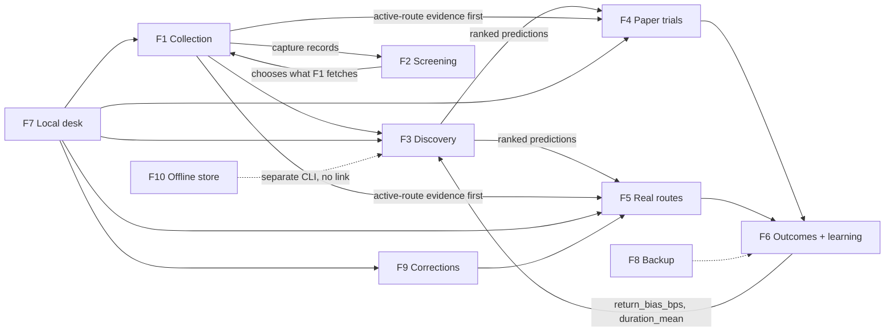
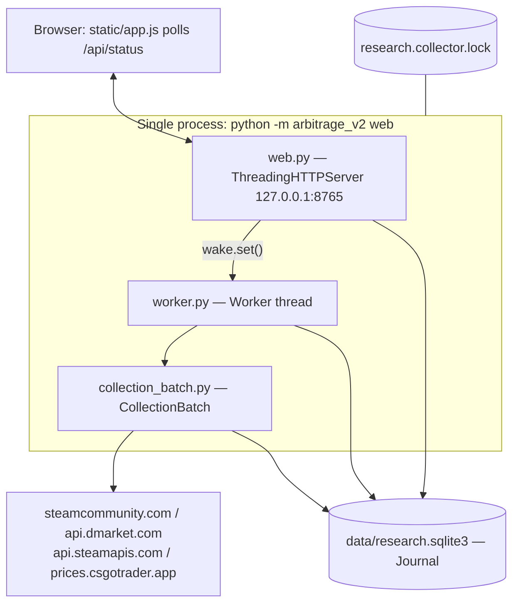
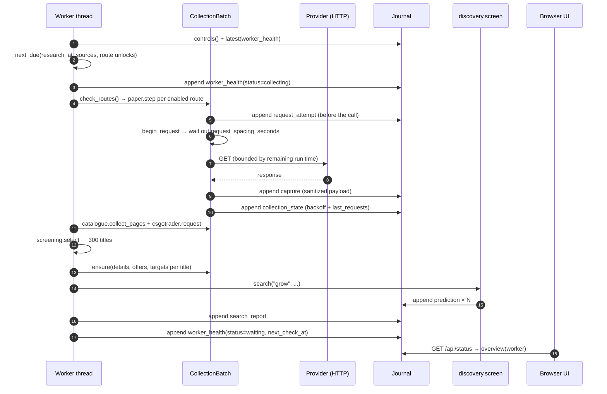

# CODEBASE_KNOWLEDGE — arbitrage-bot (Arbitrage Bot V2)

> Master knowledge document for another LLM or engineer implementing features, fixing bugs, or refactoring.
> Generated from a direct read of the repository at commit `0a88dc1` (branch `main`), package version **1.0.5**.
> All paths are relative to the repository root. All monetary values in this codebase are **integer USD cents**.

---

## Table of contents

1. [Part I — High-level overview](#part-i--high-level-overview)
2. [Part II — System architecture](#part-ii--system-architecture)
3. [Part III — Feature-by-feature analysis](#part-iii--feature-by-feature-analysis)
4. [Part IV — Things you must know before changing code](#part-iv--things-you-must-know-before-changing-code)
5. [Part V — Technical reference and glossary](#part-v--technical-reference-and-glossary)
6. [Appendix A — File index](#appendix-a--file-index)
7. [Appendix B — State block](#appendix-b--state-block)

---

# Part I — High-level overview

## 1.1 What the application is

**Arbitrage Bot V2** is a **single-user, local-only, read-only market research and bookkeeping tool** for Counter-Strike 2 (CS2, Steam `app_id` 730) virtual items.

It is **not** a trading bot. It never places an order, never authenticates to a trading endpoint, and never moves money. The word "bot" in the repository name is historical. Every real purchase and sale is performed by the human operator, by hand, in a browser. The software's job is to:

1. **Continuously collect** public market price evidence from several providers and archive it immutably.
2. **Compute** conditional round-trip economics for a specific arbitrage shape.
3. **Simulate** that round trip with pretend money ("paper" mode) against the real observed order books.
4. **Record** what the operator actually did with real money ("confirmed" mode), and only then compute profit/loss and prediction error.
5. **Learn** a small bias/duration correction from *resolved* routes only, and feed it into later estimates.

`AGENTS.md` and `docs/APPROVED_DESIGN.md` are the governing project constraints; `pyproject.toml` declares the package.

## 1.2 The business domain — the "route"

The core domain object is a **route**: one complete cycle of capital through three venues.

```
        DMarket                Steam Market              Steam Market            DMarket
   ┌──────────────┐        ┌───────────────┐        ┌────────────────┐     ┌──────────────┐
   │ BUY item A   │ ──────>│ SELL item A   │ ──────>│ BUY item B     │────>│ SELL item B  │
   │ at ask       │ trade  │ at buy-order  │ Steam  │ at lowest ask  │trade│ at target    │
   │ (cents)      │ lock   │ (−15% fees)   │ Wallet │ (spends wallet)│lock │ (−10% fee)   │
   └──────────────┘ ~7d    └───────────────┘        └────────────────┘ ~10d└──────────────┘
      entry_cost           steam_proceeds            return_purchase     predicted_dmarket_receipts
```

**Why this shape exists.** Steam Wallet funds cannot be withdrawn — they can only buy more Steam items. So value that lands in the Steam Wallet must be converted back into a *tradable item* and carried back to DMarket, where it can be sold for a withdrawable (or at least usable) balance. The profit hypothesis is that the **Steam ↔ DMarket price differential exceeds the combined ~15% Steam seller fee + ~10% DMarket seller fee plus the ~17-day trade-lock wait**.

`predicted_net_cents = predicted_dmarket_receipts_cents − entry_cost_cents − other_cost_cents` (`arbitrage_v2/prediction.py:calculate`).

| Route purpose | Meaning | Implementation status |
| --- | --- | --- |
| `grow` | DMarket → Steam → DMarket. The only implemented flow. | **Implemented and active.** |
| `start` | CSFloat → DMarket seeding. | **Deferred by the user.** `worker.search` returns `status: "deferred"` with a note. |
| `withdraw` | DMarket → … → CSFloat → bank cash. | **Deferred.** Same short-circuit. |
| `recovery` | Re-open written-off holdings from a closed route as a new linked route. | Implemented (`arbitrage_v2/recovery.py`). |

## 1.3 Target user

Exactly one person: the repository owner, running Windows 10, launching the tool from a desktop shortcut. The `README.md` and `docs/LOCAL_DESK.md` are written as operator manuals in plain, non-technical English. The `config/mandate.json` encodes their approved policy: two separate pretend $10 experiments, manual execution, user-managed risk, no automatic stop-loss, no fixed evaluation window.

## 1.4 Tech stack

| Layer | Choice | Notes |
| --- | --- | --- |
| Language | Python **3.11+** | `pyproject.toml` `requires-python = ">=3.11"` |
| Runtime deps | **`PyNaCl==1.6.2`** only | Ed25519 signing for DMarket API. That is the *entire* third-party dependency list. |
| HTTP client | `urllib.request` (stdlib) | With a custom `NoRedirect` / `ListingRedirect` opener. No `requests`, no `httpx`. |
| Web server | `http.server.ThreadingHTTPServer` (stdlib) | Bound to `127.0.0.1` only. No Flask/FastAPI. |
| Persistence | **SQLite** via stdlib `sqlite3` | Two separate databases; no ORM. |
| Frontend | Hand-written **vanilla ES2022** (`arbitrage_v2/static/app.js`, 272 lines) | No framework, no build step, no bundler, no npm dependencies. DOM built with `document.createElement`. |
| Numerics | `decimal.Decimal` + `fractions.Fraction` + `int` | **Binary floats are explicitly rejected** (`arbitrage_v2/money.py:exact_integer`). |
| Tests | stdlib `unittest`, 274 tests | `python -m unittest discover -s tests -q`. Zero test dependencies. |
| Launcher | Windows PowerShell 5.1 (`scripts/local.ps1`) | Creates Desktop + Startup `.lnk` shortcuts. |

**Design consequence:** the project deliberately has almost no dependency surface. Any change that adds a library contradicts the established convention and should be justified.

## 1.5 Architecture type

A **local-first, single-process, event-sourced desktop application** with a browser front end used purely as a remote control.

- **Event sourcing**: the SQLite journal (`data/research.sqlite3`) is a single append-only `records` table protected by `BEFORE UPDATE` / `BEFORE DELETE` triggers that `RAISE(ABORT)`. All state — route position, balances, holdings, source health, settings — is *derived* by replaying records. There is no mutable state table anywhere.
- **Single writer**: one OS-level advisory file lock (`collection_lock.py`) guarantees at most one collector process per journal.
- **In-process threading**: the HTTP server (thread-per-request) and the single `Worker` thread share the same `Journal` object and the same process. `worker.wake` (a `threading.Event`) is how the UI nudges the worker.

## 1.6 Directory structure

```
arbitrage_v2/            # The entire application package (~5,000 LOC Python)
  ├─ __main__.py         # argparse CLI entry point, dispatches to research_cli/local_cli
  ├─ journal.py          # append-only operational store (PRIMARY database)
  ├─ store.py            # immutable canonical evidence store (SECONDARY, offline-only)
  ├─ money.py            # exact integer/decimal money primitives
  ├─ evidence.py         # canonical offline evidence contract + normalization
  ├─ identity.py         # CS2 item identity/wear/float validation
  ├─ mandate.py          # approved-settings schema validation (v3 legacy + v4)
  │
  ├─ collector.py        # DMarket + SteamApis HTTP adapters, signing, sanitization
  ├─ steam_public.py     # anonymous steamcommunity.com SSR page reader
  ├─ csgotrader.py       # public bulk price/name file reader
  ├─ catalogue.py        # DMarket aggregated-prices pagination + projection
  ├─ csfloat.py          # authenticated read-only CSFloat listings (deferred)
  ├─ collection_batch.py # request ordering, pacing, deadline, scoped backoff
  ├─ collection_transport.py  # ContextVar request hooks, redirect/stream bounding
  ├─ collection_settings.py   # DEFAULTS + validation for collection tuning
  ├─ collection_lock.py  # cross-platform exclusive file lock
  │
  ├─ depth.py            # order-book normalization, whole-item quotes, paper capacity
  ├─ prediction.py       # fee math, snapshots, calculate() — the economic core
  ├─ discovery.py        # the O(n²) pair search producing ranked predictions
  ├─ screening.py        # cheap two-leg pre-ranking to pick what to fetch
  ├─ search_rules.py     # versioned ranking preferences / sale-quality priority
  ├─ capture_selection.py# "don't let a failed fetch erase good evidence"
  ├─ entry_depth.py      # one DMarket offer may fund at most one paper route
  │
  ├─ routes.py           # THE route state machine, event validation, train/refine
  ├─ paper.py            # automatic forward paper steps
  ├─ paper_entry.py      # paper route review + atomic entry
  ├─ real_routes.py      # real plan reservation + manual receipt recording
  ├─ real_funds.py       # operator-recorded DMarket funding + cash conservation
  ├─ funds.py            # unallocated/reserved account money
  ├─ holding_costs.py    # historical cost of currently-held items
  ├─ steam_wallet.py     # full Steam wallet reconciliation
  ├─ returns.py          # standalone conditional return-item review
  ├─ recovery.py         # linked recovery of written-off holdings
  ├─ route_details.py    # read-only detail view from frozen evidence
  ├─ backups.py          # verified backup / check / restore
  │
  ├─ worker.py           # the background scheduler + search orchestration
  ├─ web.py              # loopback HTTP API + static asset serving
  ├─ local_cli.py        # web/worker/paper/backup CLI commands
  ├─ research_cli.py     # collect/screen/route/train CLI commands
  └─ static/             # index.html (37 lines), app.js (272), style.css (5)

config/                  # watchlist, mandate, research assumptions, local, csfloat
docs/                    # 40+ operator/qualification/release documents
scripts/                 # local.ps1 launcher, collector.ps1, steam_rate_probe.py
tests/                   # 274 unittest tests + JSON fixtures + check_ui.cjs
data/                    # runtime: research.sqlite3, backups/ (large, gitignored content)
examples/                # synthetic_evidence.json
```

## 1.7 Feature inventory and business purpose

| # | Feature | Business purpose | Primary modules |
| --- | --- | --- | --- |
| F1 | **Continuous evidence collection** | Without a stream of fresh, timestamped order books you cannot price a route at all. Hourly cadence; missed time is an explicit *gap*, never interpolated. | `worker.py`, `collection_batch.py`, `collector.py`, `steam_public.py` |
| F2 | **Broad screening & catalogue** | The CS2 market has ~35,000 names; you cannot fetch all of them hourly. Screening cheaply pre-ranks names so the 300-item detailed budget is spent on plausible candidates. | `catalogue.py`, `csgotrader.py`, `screening.py` |
| F3 | **Route discovery & pricing** | Turn raw books into ranked, quantity-specific, fee-exact conditional estimates the operator can act on. | `prediction.py`, `discovery.py`, `depth.py`, `search_rules.py` |
| F4 | **Paper trials** | Test the hypothesis with zero capital at risk, using real observed depth and real waits, to produce resolved outcomes that can train the model. | `paper_entry.py`, `paper.py`, `entry_depth.py` |
| F5 | **Real route bookkeeping** | Reserve funds against a saved plan, then record what actually happened, with immutable corrections and cash-conservation checks. | `real_routes.py`, `real_funds.py`, `funds.py`, `steam_wallet.py` |
| F6 | **Resolution, outcomes & learning** | Only a finished route yields truth. Compare actual vs. frozen prediction; average the bias; feed forward. | `routes.py` (`add_event` resolve branch, `train`, `refine`) |
| F7 | **Local desk UI** | A single-page operator console; the process must keep running when the browser closes. | `web.py`, `static/*`, `scripts/local.ps1` |
| F8 | **Backup / restore** | Protect an irreplaceable append-only history against corruption, with verified replay. | `backups.py` |
| F9 | **Recovery & corrections** | Reality diverges from records. Fix open records without rewriting closed results. | `routes.py:correct_event`, `recovery.py` |
| F10 | **Canonical offline evidence store** | A separate, stricter, fully-immutable ingestion path for hand-curated evidence envelopes. Legacy/parallel to F1. | `store.py`, `evidence.py` |

## 1.8 How the features relate



The loop is: **collect → screen → discover → enter → step → resolve → train → discover better**. F10 is an island: nothing in the live path reads `data/evidence.sqlite3`.

---

# Part II — System architecture

## 2.1 Process and component topology

See [`assets/architecture.mmd`](assets/architecture.mmd). Rendered inline:



**Key structural facts**

- `local_cli.run()` (`arbitrage_v2/local_cli.py`) is the single composition root for the desk: it acquires `collection_lock`, builds `Worker`, builds the HTTP server, starts the worker thread, then `serve_forever`. On shutdown it sets `worker.stop`, sets `worker.wake`, and joins with a 25-second timeout.
- The `Worker` thread loop is `while not stop: tick(clock()); wake.wait(2); wake.clear()`. It wakes every 2 s but almost always returns immediately after a cheap `_next_due` time comparison.
- `Worker.tick` uses `self.mutex.acquire(blocking=False)`. **An overlapping tick is discarded, never queued.** There is no catch-up backlog.
- `web.py` never talks to a provider. It only reads journal projections and appends operator records. The one exception is the synchronous `search` action, which is CPU-only (`discovery.screen` over already-captured evidence) and is rejected with HTTP 409 while `worker.busy`.

## 2.2 Storage model

### 2.2.1 `data/research.sqlite3` — the Journal (primary)

`arbitrage_v2/journal.py`. One table:

```sql
CREATE TABLE records (
  seq INTEGER PRIMARY KEY,   -- insertion order, the authoritative total order
  id TEXT UNIQUE NOT NULL,   -- idempotency key
  category TEXT NOT NULL,
  recorded_at TEXT NOT NULL, -- wall clock at write; distinct from payload "at"
  payload TEXT NOT NULL      -- canonical JSON (sorted keys, no spaces)
);
CREATE INDEX records_category ON records(category, seq);
CREATE TRIGGER records_no_update BEFORE UPDATE ON records BEGIN SELECT RAISE(ABORT,'immutable journal'); END;
CREATE TRIGGER records_no_delete BEFORE DELETE ON records BEGIN SELECT RAISE(ABORT,'immutable journal'); END;
PRAGMA user_version = 1;
```

`Journal.append(category, payload, identifier=None, db=None)`:
- The default `identifier` is `sha256(category + "\n" + canonical_json)`, making content-identical appends naturally idempotent.
- If the `id` already exists with a **different** `(category, payload)`, it raises `"idempotency key conflicts with existing record"`.
- `Journal.connect(write=True)` opens the file URI with `?mode=rw` and immediately issues `BEGIN IMMEDIATE`, i.e. a write lock for the whole `with` block.

**Record categories** (complete list, grepped from `journal.append` call sites):

| Category | Deterministic id | Written by | Purpose |
| --- | --- | --- | --- |
| `capture` | `capture:<uuid4>` | `collector.capture`, `steam_public.capture_public`, `catalogue.fetch`, `csfloat.capture_listings` | One provider response (sanitized) |
| `request_attempt` | `attempt:<uuid4>` | `collection_transport.prepare_request` | Written **before** the HTTP call; counts requests |
| `collection_state` | content hash | `CollectionBatch._save` | Source backoff + last-request-per-provider (survives restart) |
| `worker_health` | content hash | `Worker.tick`/`_tick` | Scheduler status, next check, source states, route checks |
| `worker_control` | `control:<uuid4>` | `worker.control` | `pause` / `resume` / `check_now` |
| `search_settings` | content hash | `web.py` action | `minimum_purchase_cents`, `narrow_spread_bps` |
| `search_report` | content hash | `worker._tick`, `web.py`, `local_cli` | Full ranked discovery output |
| `prediction` | content hash | `discovery.screen`, `routes.refine`, `recovery.open_recovery` | A frozen conditional estimate |
| `model` | content hash | `routes.train` | `return_bias_bps` + `duration_mean_seconds` |
| `route` | `route:<route_id>` | `routes.open_route`, `recovery` | Binds route_id ↔ prediction_id ↔ mode |
| `route_event` | `event:<event_id>` | `routes.add_event` | progress / movement / asset / resolve / cancel |
| `event_correction` | `correction:<correction_id>` | `routes.correct_event` | Overlay replacing one open event's amount |
| `outcome` | `outcome:<route_id>` | `routes.add_event` (resolve branch) | Actual vs. predicted, P&L |
| `paper_settings` | content hash | `paper.configure` | Frozen return basket + policy + engine version |
| `paper_entry` | `paper-entry:<route_id>` | `paper_entry.enter` | Entry fills (offer ids) + funding |
| `paper_decision` | `paper:<uuid4>` | `paper.step` | One simulated transition |
| `paper_book` | content hash | `depth.consume` | Simulated depth consumption state per book |
| `confirmed_entry` | `confirmed-entry:<route_id>` | `real_routes.enter` | Real plan + reserved funding |
| `real_step` | `real-step:<action_id>` | `real_routes.record_step` | One operator-recorded receipt |
| `real_funding` | `real-funding:<funding_id>` | `real_funds.record_funding` | opening / add / withdraw / unlock |
| `funding_correction` | `funding-correction:<id>` | `real_funds.correct_funding` | |
| `steam_wallet_record` | `steam-wallet:<wallet_id>` | `steam_wallet.record` | balance / adjustment |
| `steam_wallet_correction` | `steam-wallet-correction:<id>` | `steam_wallet.correct` | |
| `recovery_link` | `recovery:<route_id>` | `recovery.open_recovery` | Written-off holdings → new route |
| `return_review` | content hash | `returns.review_returns` | Standalone conditional return options |
| `catalogue_progress` | content hash | `worker._tick` | Which titles were checked, selection counter |
| `catalogue_navigation` | content hash | `catalogue.collect_pages` | Cursor reset on a repeated-cursor loop |
| `screening_snapshot` | `screening:<uuid>` | `csgotrader.fetch` | The parsed bulk price file |
| `screening_names` | content hash | `csgotrader.fetch` | Append-only new-name delta |
| `screening_check` | `screening-check:<uuid>` | `csgotrader.fetch` | Each refresh attempt incl. 304 |
| `screening_selection` | content hash | `worker._tick` | Audit of why each item was selected |
| `journal_restore` | content hash | `backups.restore_backup` | Restore provenance |

Logical relationships: [`assets/journal-model.mmd`](assets/journal-model.mmd).

### 2.2.2 `data/evidence.sqlite3` — the EvidenceStore (secondary, offline)

`arbitrage_v2/store.py`, schema version 1, tables `observations` + `sales`, all four mutation triggers set to `RAISE(ABORT)`. It stores the **raw bytes** of an ingested envelope plus its canonical normalization, and re-verifies both `sha256(raw) == id` and `canonical(normalize(raw)) == stored` on every `get`. Reached only via `arbitrage-v2 init | ingest | status | inspect`. **No live code path reads it.** See [§3.10](#310-f10--canonical-offline-evidence-store-legacy-island).

## 2.3 Data flow — the main loop



## 2.4 Request lifecycle and provider integration

`arbitrage_v2/collection_transport.py` installs a `ContextVar` holding `{begin, remaining, complete}`. Every adapter calls `prepare_request(journal, request, id)` immediately before opening a socket. That function:

1. Calls `ctx['begin'](request)` → `CollectionBatch.begin_request`, which **blocks** until the per-provider spacing has elapsed (checking pause/stop at least 4×/second via `self.wait(min(delay, remaining, 0.25))`).
2. Appends a `request_attempt` record.
3. Returns a socket timeout of `min(20, max(0.001, remaining_run_seconds))`.

`read_response(response, limit)` streams in ≤64 KiB chunks and re-checks remaining run time each chunk, re-arming the underlying socket timeout — so a slow trickle cannot outlive the run deadline.

`prepare_redirect` makes a **Steam redirect count as its own paced request** (`steam_public.ListingRedirect`).

### Provider matrix

| Provider | Endpoint(s) | Auth | Spacing default | Module |
| --- | --- | --- | --- | --- |
| `steam_public` | `GET steamcommunity.com/market/listings/730/<title>?currency=1&l=english` | none (anonymous) | 5 s | `steam_public.py` |
| `steamapis` | `GET api.steamapis.com/v2/steam/items/730/<title>`, `/v2/account` | `x-api-key: STEAMAPIS_KEY` | 30 s | `collector.py` |
| `dmarket` | `GET /marketplace-api/v2/offers`, `GET /marketplace-api/v1/targets-by-title/a8db/<title>`, `POST /marketplace-api/v1/aggregated-prices`, `GET /exchange/v1/customized-fees` | Ed25519 `X-Request-Sign` | 2 s | `collector.py`, `catalogue.py` |
| `csgotrader` | `GET prices.csgotrader.app/latest/steam.json` | none | 5 s | `csgotrader.py` |
| `csfloat` | `GET csfloat.com/api/v1/listings` | `Authorization: CSFLOAT_API_KEY` | n/a (CLI only) | `csfloat.py` |

The **allowlist is enforced twice**: `collector.request_spec` raises `"endpoint is outside the read-only allowlist"` for anything but `offers|targets|fees`, and `collection_batch.request_key` rejects any `(provider, kind)` pair outside an explicit set.

**DMarket signing** (`collector.sign`): message = `"GET" + decoded_path + ("?"+query if query) + timestamp`, Ed25519 over a 32-byte seed (a 64-byte hex secret is truncated to its first 32 bytes). The **decoded** path is signed while the **percent-encoded** path is transmitted — this asymmetry is deliberate and is the single most likely source of 401s if refactored. `catalogue.fetch` signs `"POST" + PATH + body + ts` instead.

### Failure scoping — the most important resilience mechanism

`collection_batch.failure_scope(request, result)` classifies every failure into one of three blast radii:

| Scope | Triggered by | Key shape (`scope_key`) |
| --- | --- | --- |
| `provider` | missing credentials, `401`, `429`, `5xx`, `network_*`, `provider_allowance_exhausted` | `dmarket` |
| `endpoint` | `403`, or `kind in {catalogue, screening}` | `dmarket:offers` |
| `item` | `400`, `404`, `422`, `invalid_json_or_size`, `invalid_or_unsupported_steam_page` | `steam_public:details:730:<sha256(title)[:24]>` |

One unparseable skin page therefore blocks **only that title**, not Steam collection. `ensure()` checks all three applicable keys before every request. This was the explicit purpose of release 1.0.3 (`docs/COLLECTION_RELIABILITY.md`).

Backoff state lives in `collection_state` records and is reloaded by `normalize_sources` on every tick, so **a restart cannot bypass a 429 cooldown**.

## 2.5 Cross-cutting concerns

### Security

- **Network posture**: `ThreadingHTTPServer(("127.0.0.1", port))`. `Handler.host_ok()` additionally requires the literal `Host: 127.0.0.1:<port>` header, defeating DNS-rebinding.
- **CSRF**: every `POST /api/action` requires (a) correct `Host`, (b) `Origin: http://127.0.0.1:<port>`, and (c) `X-Local-Token` matching a per-process `secrets.token_urlsafe(32)` compared with `secrets.compare_digest`. The token is served from `GET /api/session` and held only in memory — restarting the process invalidates every open tab.
- **CSP**: `default-src 'self'; script-src 'self'; style-src 'self'; connect-src 'self'; frame-ancestors 'none'; base-uri 'none'; form-action 'self'` plus `X-Content-Type-Options: nosniff`, `Referrer-Policy: no-referrer`, `Cache-Control: no-store`.
- **Secrets**: `collector.credentials()` reads only four named keys, environment first, then an explicit `--env-file`. The launcher persists only the *path*. `collector.sanitize()` recursively replaces any key whose lowercase letters-only form is in `{apikey, token, authorization, cookie, secret, secretkey, tradetoken}` with `[REDACTED]` before archiving. Request headers and HTTP error bodies are **never** stored — errors are reduced to `"http_<code>"`.
- **Logging**: `Handler.log_message` is a no-op, explicitly "to avoid persisting user-entered references or query strings".
- **Parser safety**: `steam_public` uses `html.parser.HTMLParser` to extract inline `<script>` text, then `json.JSONDecoder().raw_decode` — it **decodes** page JSON, it never executes it. Redirects are permitted only to `https://steamcommunity.com/market/listings/730/…` with no fragment (`allowed_url`).
- **Input bounds**: title ≤300 chars with no control characters; request body 1–32768 bytes; responses capped at 4 MB (Steam/DMarket/CSFloat), 200 KB (SteamApis account), 16 MB (csgotrader).

### Error handling convention

Domain errors are plain `ValueError` with **operator-facing English messages** (`"There is not enough uncommitted real DMarket money for this plan."`). `web.py` catches `(ValueError, KeyError, TypeError, OSError, sqlite3.Error)` and returns HTTP 400 with `str(exc)` on POST, but on GET returns only `"Unable to read local data: " + type(exc).__name__` to avoid leaking internals. `__main__.main` catches the same family and prints `{"error": ...}` to stderr with exit code 2.

`Worker.tick` catches bare `Exception`, records `worker_<ExcType>` as a **fatal** health status, and stops working until the operator presses Pause/Resume or Check prices — a deliberate fail-stop.

### Caching

Three in-process memoizations, all attached as attributes on the `Journal` instance and all keyed on `max(seq)` of the relevant categories so they self-invalidate:

- `journal._catalogue_cache` — `catalogue.view()` incrementally folds only new records.
- `journal._screening_cache` — `csgotrader.view()`.
- `discovery.capture_index(journal, as_of)` — one full projection per scan instead of three journal reads per item.
- `discovery.screen`'s `quote_cache` dict — memoizes `depth.quote` results across the O(n²) pair loop.

### Time

Every timestamp is an aware UTC ISO-8601 string with microsecond precision (`evidence.stamp`). `evidence.utc()` **rejects naive timestamps** ("naive timestamps are not evidence"). The codebase consistently distinguishes:

- `observed_at` / `source_time` — when the *market* observed the data (Steam's embedded `dataUpdatedAt`),
- `retrieved_at` — when *we* got the response,
- `recorded_at` — when the row was written to SQLite,
- `at` — the operator-supplied business time of an event.

Freshness is always measured from `observed_at`/`source_time`, never from `retrieved_at` (see `docs/FOLLOWUP_OBSERVATIONS_2026-09-08.md`: price history can refresh while the book stays stale).

---

# Part III — Feature-by-feature analysis

## 3.1 F1 — Continuous evidence collection

**Business need.** A route cannot be priced without a recent, exact order book on both venues for both items. The market moves; evidence expires (default `freshness_seconds = 14400`, i.e. 4 hours). The tool must keep a rolling supply of fresh books without tripping provider rate limits, and must be honest about time it missed.

### Entry points

| Trigger | Path |
| --- | --- |
| Background | `Worker.run` → `Worker.tick` → `Worker._tick` |
| UI "Check prices now" | `POST /api/action {"action":"check_now"}` → `worker.control` → `worker.wake.set()` |
| CLI one-shot | `arbitrage-v2 collect <watchlist> --request-budget N` → `collector.collect_once` |

### Scheduling (`worker.py`)

`_initial_research_at(health, at)` resolves the next regular anchor, in priority order:
1. `health["next_research_at"]`, **shifted** if `collection_interval_seconds` changed since it was written (keeps the anchor phase rather than restarting the cycle);
2. `last_success_at + interval`;
3. `health["next_check_at"]`;
4. on a *completely empty* health history: `MAX(retrieved_at) + interval` over recorded, error-free captures;
5. otherwise `at` (run now).

`_advance_schedule(due, at)` jumps forward by whole intervals: `due + (floor(elapsed/interval)+1) * interval`. **A machine that was off for 10 hours performs one overdue check, not ten.**

`_next_due` takes the minimum of: the research anchor, every pending source `next_retry_at`, every active route's `next_eligible_at` not yet checked, and `at` for a newly-enabled paper route.

### Priority ordering inside a run

1. **Active-route evidence first** (`check_routes()`), before any research. For paper routes the needs come from `paper.required_evidence`; for real routes from `Worker._route_requests`, which maps the current stage to `(title, kind)` pairs.
2. `batch.before_request = check_unlocks` — a hook that fires before *every* subsequent request. If a route's unlock time passed mid-run, its checks jump the queue. `check_routes(due_only=True)` first does `batch.seen.discard(request_key(req))` because **a fetch made before the unlock cannot satisfy an unlock-time check**.
3. Source retries.
4. Catalogue pages + screening file.
5. The 300-item research roster.
6. `discovery.screen` (CPU) — also interruptible via `batch.calculation_stopped`.

### Run deadline

`CollectionBatch` holds **two** deadlines: a wall-clock one (`utc(clock()) + max_run_seconds`) and a `time.monotonic()` one. `remaining()` is the **minimum** of both, so a system clock jump cannot extend or truncate a run.

### Freshness selection (`capture_selection.select_captures`)

For each `(app_id, title, kind)`, take the newest capture by `retrieved_at` (ignoring anything recorded after `as_of`). If that newest attempt **failed**, fall back to the newest *successful* capture **within the same `input_kind` partition**, and attach a `latest_request_failure` descriptor so the UI can show the failure separately. A newer **successful but empty/invalid** book *does* supersede older prices — the selector never resurrects stale quantities behind a legitimately empty book.

### Edge cases and hidden dependencies

- `request_for` (`collection_batch.py`) picks the Steam provider: the per-title override in `watchlist["item_sources"]`, else `watchlist["steam_source"]`. But if the catalogue is enabled and the title is neither in `watchlist["items"]` nor in `item_sources`, it is **forced to `steamapis`** — so catalogue-discovered items depend on a SteamApis key even though direct Steam is the default. This is the practical coverage bottleneck.
- Before its first SteamApis request in a batch, `ensure()` calls `collector.free_access`, which reads `/v2/account` and requires `overageEnabled is False`. If overage cannot be confirmed, SteamApis is failed at provider scope for the run. That check consumes a paced request slot.
- `Worker._tick` clears `sources` entries whose failure was transient *and* whose retry sequence ended, but only on a `regular_due` tick — so a manual check will not resurrect a burnt-out retry chain.
- A `manual` tick filters `sources` down to only those with a pending `next_retry_at` — i.e. an operator **can** retry an access/format block but **cannot** bypass a cooldown or a scheduled server retry.

## 3.2 F2 — Broad screening and catalogue

**Business need.** ~35,000 CS2 names exist; the hourly budget is 300 *distinct variants* × 3 requests. Screening decides which 300.

### Three name sources, merged

1. **DMarket catalogue** (`catalogue.py`) — `POST /marketplace-api/v1/aggregated-prices` with `{"filter":{"game":"a8db"},"limit":"100","cursor":…}`. Up to `catalogue_pages_per_run` (10) pages per run. The cursor persists across restarts in the `catalogue_view` projection; `collect_pages` records a `catalogue_navigation` warning and resets on a repeated cursor. Each row yields `dmarket_ask_cents` (`offerBestPrice`) and `dmarket_bid_cents` (`orderBestPrice`), explicitly labelled `depth_qualification: "summary_only_not_available_at_best_price"`.
2. **CSGO Trader** (`csgotrader.py`) — one public gzip JSON file of ~34k names. Conditional `If-None-Match` / `If-Modified-Since`; a `304` is a *successful check*, not a failure, and keeps the original publication age. Body hash short-circuits re-parsing of an unchanged file.
3. **Watchlist items + exploration items + anything already captured**.

### The qualification gate that disables CSGO Trader prices

```python
PRICE_CONTRACT = {'currency':'USD','unit':'usd','buyer_fees':'unverified', ...}
qualified = (contract['buyer_fees'] == 'included' and PRICE_CONTRACT['buyer_fees'] == 'included')
```

Since the module constant is hard-coded to `'unverified'`, `hints()` **always returns an empty `items` map** in production. Only the *names* are used. This is intentional (`docs/CSGOTRADER_SCREENING.md`): the producer historically copied SteamApis `safe_ts` values whose buyer-fee meaning was never established, so scoring on them would silently corrupt rankings. It is a **code-review gate, not a settings switch** — flipping a config value cannot enable it.

### Two-leg scoring (`screening.select`)

For each candidate title, build four price hints, each preferring detailed evidence over a summary:

| Slot | Preference chain |
| --- | --- |
| `buy_a` (outward purchase) | detailed `dmarket_ask` → DMarket summary ask |
| `sell_a` (outward sale) | detailed `steam_bid` → detailed `steam_ask` → csgotrader hint |
| `buy_b` (return purchase) | detailed `steam_ask` → csgotrader hint |
| `sell_b` (return sale) | detailed `dmarket_bid` → detailed `dmarket_ask` → summary bid → summary ask |

```
outward_ratio   = Fraction(steam_net(sell_a), buy_a)     # Steam cents received per DMarket cent spent
returning_ratio = Fraction(dmarket_net(sell_b), buy_b)   # DMarket cents received per Steam cent spent
```

`Fraction` is used so ranking is exact and order-stable. Three queues are built (`outward`, `returning`, `exploration` — the last sorted by *oldest checked first*) and drained in the repeating pattern `['outward','outward','returning','returning','exploration']`, targeting 120/120/60 in a 300 slot batch. If a queue is empty its slot falls through to the other queues, ending with exploration. The `selection_count` counter persists in `catalogue_progress`, so the pattern phase continues across runs rather than restarting.

**Skip rule.** A title is skipped entirely if all three kinds (`details`, `offers`, `targets`) are recorded, successful, and fresher than `refresh_seconds`, **and** `_steam_observation` still validates. A *successful empty book* counts as a recent check — the code deliberately does not re-poll an item just because no supply was observed.

**Refresh-age subtlety** (`worker._tick`):
```python
refresh_age = max(0, research_refresh_seconds - (collection_interval_seconds if regular_due else 0))
```
On a regular hourly run this becomes `0`, forcing everything to look stale. Rationale in the source comment: *"Select books that would miss their refresh target before the next regular run"* — otherwise a capture taken 30 seconds into the previous run would be "fresh" at the next hourly tick and skip every second scan.

## 3.3 F3 — Route discovery and pricing

This is the economic heart. Read `prediction.py` before touching anything here.

### Fee arithmetic (`prediction.py`)

```python
def steam_net(gross, steam_bps, game_bps, minimum_steam, minimum_game):
    # binary search for the largest net where
    #   net + max(min_steam, net*steam_bps//10000) + max(min_game, net*game_bps//10000) <= gross
```

**This inverts Steam's buyer-price → seller-receipt mapping, per item, with each fee component floored separately.** It must be applied to the **unit** price and only then multiplied by quantity. The docstring is explicit: *"twelve 66c CS2 sales yield 12 × 59c, not net(12 × 66c)"*. `docs/STEAM_FEE_AUDIT.md` records verification against Steam's own `economy_common.js` for all 998 integer buyer prices from 3¢ to $10.00, with the fixture at `tests/fixtures/steam_usd_fee_reference.json`.

```python
def dmarket_net(gross, bps, minimum=0):
    return max(0, gross - max(minimum, (gross*bps + 9999)//10000))   # fee rounds UP
```

Defaults from `config/research_assumptions.json`: Steam 500 bps + game 1000 bps, both with 1¢ minima; DMarket 1000 bps with 1¢ minimum.

### Depth normalization (`depth.py`)

`levels(rows, side, unit, price_key, quantity_key, semantics)`:
- Requires explicit `side ∈ {bid, ask}` and `semantics ∈ {incremental, cumulative}` — no inference.
- **Duplicate aggregate rows never add demand**: `prices[p] = q`, and a *conflicting* duplicate raises.
- Sorts descending for bids, ascending for asks (execution order), then converts cumulative → incremental, rejecting non-increasing cumulative quantities.
- Assigns `level_id = str(price_cents)` for aggregate books. For DMarket offers, `_offer_ask` uses the real `offerId` as `level_id` — which is what makes per-offer reservation in `entry_depth.py` possible.

`quote(rows, quantity, net=None, budget=None)` walks levels, optionally applying `net` per unit and capping by `budget // price` per level, returning `{quantity, gross_cents, net_cents, fee_cents, complete, fills}`.

### Snapshot builders

| Function | Books required | Used by |
| --- | --- | --- |
| `market_snapshot` | `details` + `offers` + `targets` | legacy full-entry review |
| `steam_sale_snapshot` | `details` | paper outward sale |
| `destination_snapshot` | `targets` | paper return sale |
| `return_snapshot` | `details` + `targets` (+ optional `offers` as `comparison_ask`) | paper return purchase, `returns.review_returns` |
| `discovery.snapshot` | each kind independently | discovery (per-side failure tolerance) |

`_market_captures` enforces: capture present, `status == 200`, no `error`, `0 <= age <= max_age_seconds`, and a **single** `input_kind` across all required kinds (`mixed_or_unknown_evidence_kind` otherwise).

`_steam_observation` additionally enforces `appId == 730`, exact `marketName` match, a boolean `commodity` flag, `marketable`/`tradable` not `False`, and book freshness measured from `histogram.date`.

`_offer_ask` (DMarket offers → ask book) filters to `gameId == "a8db"`, `withdrawable is True`, `tradable is True`, `locked is False`, exact title, and `identity.base_offer(attr, title)` — which for a wear-suffixed title requires the reported `cs2.float` to fall inside that wear's canonical band. Each surviving offer becomes a **quantity-1 level keyed by its `offerId`**.

`_steam_book` has a **critical conditional**: it returns full multi-level depth only when `payload.provenance.book_quantity_semantics ∈ {incremental, cumulative}`. Only `steam_public.normalize_fields` sets that field. **SteamApis captures therefore degrade to top-of-book only** via `_top()`, because their lower-level quantity contract was never qualified.

### Three sale scenarios

`SALE_BOOKS` in `discovery.py` crosses each venue with three modes:

| Mode | Basis | Engine version | Can auto-fill paper? |
| --- | --- | --- | --- |
| `current_bids` | Walks observed buy-order depth. A real, if unreserved, demand estimate. | `observed-depth-v2` | **Yes** |
| `listing_price` | Assumes a sale at the lowest observed ask. `quantity_is_assumed: True`, `fills: []`. | `listing-price-scenarios-v1` | No |
| `midpoint` | `(best_bid + best_ask) // 2`, requires `bid <= ask`. | `midpoint-price-scenarios-v1` | No |

Only `observed-depth-v2` predictions can be entered as automatic paper trials (`paper.configure` and `paper_entry._review` both reject others). Asks are price *references*, never demand.

### `calculate(a, b, quantity, policy, steam_mode, dmarket_mode, return_quantity_limit, cache)`

```
entry   = quote(a.dmarket_ask, quantity)                       # must be complete
sale    = sale_quote(a, "steam",   quantity, steam_net,  steam_mode)
purchase= quote(b.steam_ask, return_limit, budget=sale.net_cents)
exit    = sale_quote(b, "dmarket", purchase.quantity, dmarket_net, dmarket_mode)

entry_cost_cents               = entry.gross_cents
steam_proceeds_cents           = sale.net_cents
return_purchase_cents          = purchase.gross_cents
steam_wallet_residual_cents    = sale.net_cents - purchase.gross_cents
predicted_dmarket_receipts_cents = exit.net_cents
base_net_cents = predicted_net_cents = exit.net_cents - entry.gross_cents - other_cost_cents
```

`family` is `cs2_standard_case_cycle_v1` when both titles end in `" Case"`, else `cs2_standard_item_cycle_v2`. These are **separate learning families**.

If `policy["other_cost_cents"] is None`, `base_net_cents` and `predicted_net_cents` are `None` and `costs_known` is `False` — an unknown-cost route stays visible but can never be entered.

### The search (`discovery.screen`)

```
for source_a in snapshots:                     # O(n)
  for steam_mode in 3:
    for source_b, dmarket_mode in snapshots × 3:   # O(n × 3)
      for quantity in 1..upper:                    # upper ≤ 1000
        for return_limit in [None, narrow]:
          calculate(...)
```

`upper = min(capital_cents // ask_price, total_ask_depth, 1000)` and, for `current_bids`, additionally `total_bid_depth`. Every (item_a, item_b, steam_mode, dmarket_mode, quantity, return_limit) tuple that survives becomes a **separately persisted `prediction` record**. All predictions are written inside one `BEGIN IMMEDIATE` transaction at the end.

Rejections are not dropped — they are aggregated into `scenario_limits` with `quantities_affected` counts, so the UI can explain *why* nothing was found.

`return_limits` includes a "narrow spread boundary": when the best bid ≤ the ask and only some bid levels sit within `narrow_spread_bps` of the ask, a second candidate quantity capped at that narrow volume is evaluated. It is discarded if it produces the same `quantity_b` as the unlimited case.

### Ranking (`search_rules.py`)

`route_priority = max(steam_leg.priority, dmarket_leg.priority)` where:

| Priority | Condition |
| --- | --- |
| 1 | `current_bids`, quote complete, consistent bid≤ask, and the **worst used bid** is within `narrow_spread_bps` of the ask |
| 2 | `current_bids`, otherwise |
| 3 | `midpoint` |
| 4 | `listing_price` |

```python
sort_key(p) = (net <= 0,            # losses always last
               route_priority,       # covered bids before assumptions
               net is None,
               -net, entry_cost, item_a, item_b, qty_a, qty_b, steam_mode, dmarket_mode)
```

Settings persist as `search_settings` records; `search_rules.current()` reads the latest or falls back to `{'minimum_purchase_cents': 10, 'narrow_spread_bps': 1000}`.

### Learning integration

Before the pair loop, `screen` calls `routes.train(...)` for each of the 6 `(family, engine)` combinations, swallowing only the exact `"no resolved outcomes for this family and evidence mode"` error. When a model exists **and** the prediction is `recorded` **and** `base_net_cents is not None`:

```python
predicted_net_cents = base_net_cents + entry_cost_cents * model.return_bias_bps // 10000
predicted_duration_seconds = max(minimum_known_delay_seconds, model.duration_mean_seconds)
```

`base_net_cents` is preserved untouched so calibration never compounds recursively.

## 3.4 F4 — Paper trials

**Business need.** Prove or disprove the hypothesis with zero capital, producing genuinely resolved outcomes that can train the model — while making it *impossible* for the simulation to invent liquidity.

### Entry: `paper_entry.py`

`preview(journal, prediction_id, mandate, policy, at)` opens a read transaction and runs `_review`, which accumulates plain-English blockers:

| Blocker | Guard |
| --- | --- |
| Unsupported family / purpose / app | `family ∉ {FAMILY, ITEM_FAMILY}` or `purpose != "grow"` or `app_id != 730` |
| Listing/midpoint estimate | `engine_version != ENGINE` |
| Synthetic evidence | `input_kind != "recorded"` |
| Confirmed-mode estimate | `learning_mode`/`search_mode` not `paper` |
| Assumptions drifted | `pred["policy"] != policy` |
| Not profitable after declared costs | `not costs_known` or `predicted_net_cents <= 0` or `base_net_cents <= 0` |
| Stale/future estimate | age outside `[0, 14400]` s, or `recorded_at > at` |
| Insufficient / negative funds | vs. `funds.account_money` |
| Funding-type mismatch | restricted `tradable` can only do `market_purchase` for app 730 |
| **Evidence changed** | re-runs `route_inputs` + `calculate` and requires `evidence_ids` **and** `quote_legs` to be byte-identical to the frozen prediction |

Funding is drawn **tradable first, then regular** — spending the restricted balance on the only action it supports (`may_use_balance`).

`enter(journal, request, mandate, policy, at)` is fully atomic inside one `journal.connect(True)`:
1. Idempotency check on `paper-entry:<route_id>`; a re-submit with identical `request` returns `already_opened`, a different one raises.
2. `_review` again (the preview's result is never trusted).
3. `open_route(... mode="paper")`.
4. Funding debit `movement` events.
5. `asset` event crediting `730:<item_a>` × `quantity_a`.
6. `progress` → `steam_locked` with `next_eligible_at = at + (minimum_known_delay_seconds − minimum_return_delay_seconds)` (default 1,468,800 − 864,000 = 604,800 s = **7 days**).
7. `paper.configure(...)` freezing the return basket to `[item_a, item_b]` deduplicated.
8. A `paper_entry` record storing `entry_fills` (the actual `offerId`s), funding, evidence ids.

### Offer reservation: `entry_depth.unused_entry`

Collects every `level_id` already recorded in any `paper_entry.entry_fills` for the same `(input_kind, app_id, item_a)` and removes those offers from the ask book. If a *legacy* paper route exists with a DMarket debit but no `paper_entry` record, the function reconstructs its offer pool from the prediction's `offers` captures and excludes **all** of them; if that pool cannot be reconstructed it raises `legacy_paper_entry_offer_ids_unknown` rather than risk double-spending an offer. Raises `paper_entry_offers_already_used` when nothing remains.

### Stepping: `paper.step(journal, route_id, at)`

One atomic transition per call, inside one write transaction. Dispatch is on the current stage:

| Stage | Action | Books | Result |
| --- | --- | --- | --- |
| `steam_locked` / `awaiting_steam_sale` | `steam_sale` | `steam_bid` of item A | asset −q, `steam_wallet` += `steam_net`; → `steam_wallet` (full) or stays `awaiting_steam_sale` (partial) |
| `steam_wallet` | `return_purchase` | `steam_ask` + `dmarket_bid` for **every** basket title | `steam_wallet` −gross, asset `730:<title>` +q; → `return_item_locked` with `at + minimum_return_delay_seconds` (10 d) |
| `return_item_locked` / `awaiting_dmarket_sale` | `dmarket_sale` | `dmarket_bid` of the held item | asset −q, `dmarket_tradable` += `dmarket_net`; → `awaiting_settlement` |
| `awaiting_settlement` | `resolved` | — | records `other_cost_cents` as `external_cost`, then `resolve/completed` |

Non-advancing statuses returned instead of raising: `paused`, `resolved`, `waiting_for_unlock`, `waiting_for_evidence`, `manual_decision`, `waiting_for_new_depth`.

**Guards worth knowing:**
- `snapshot_for` rejects a quote whose `source_time` predates the route's `next_eligible_at` — *"a fresh retrieval from before eligibility cannot act as a later price"*.
- The return step aborts with `waiting_for_evidence` if **any** basket title is missing data. It will not silently narrow a predeclared basket.
- Selection order: `(return_quality.priority, −net_receipts, leftover_wallet, title)` — covered narrow-spread bids beat raw receipts.
- Any leftover asset or non-zero wallet at `awaiting_settlement` yields `manual_decision: leftovers_require_user_decision`. **The engine never auto-writes-off.**

### Shared depth consumption: `depth.available` / `depth.consume`

This is the mechanism that prevents infinite paper profit.

```python
for identity in state.keys() | observed.keys():
    old  = state.get(identity, {"visible":0, "available":0})
    new  = observed.get(identity, {}).get("quantity", 0)
    change = new - old["visible"]
    updated[identity] = {"visible": new, "available": max(0, old["available"] + change)}
```

Capacity replenishes **only on an observed positive increase** in visible quantity. Re-fetching the same unchanged book adds nothing. A level disappearing reduces unused capacity first and is **never** described as a completed sale. State is namespaced per `f"{ENGINE}:{input_kind}:730:{title}:{book_name}"`, so it is shared across *all* paper routes touching the same book.

### Automatic stepping from the worker

`Worker.check_routes` loops up to **4** transitions per route per pass, re-fetching required evidence each time via `paper.required_evidence` → `batch.ensure`, and stops early on any non-`advanced` status. `required_evidence` plans *only* the books the current stage needs — not all books the original prediction used.

## 3.5 F5 — Real route bookkeeping

**Business need.** Money moves in the real world; the tool records it, checks it for internal consistency, and refuses to let records imply impossible cash positions. It places no orders.

### Funding first (`real_funds.py`)

| Kind | Rule |
| --- | --- |
| `opening` | Exactly once, before any confirmed route exists. |
| `add` | Requires a prior opening; `regular + tradable > 0`. |
| `withdraw` | Regular only, positive, `tradable` must be 0; recorded as `−regular`. |
| `unlock` | Regular only; `funding_changes` maps it to `{regular: +x, tradable: −x}` — a *transfer*, not new money. |

Funding records must be chronologically non-decreasing. Corrections (`funding_correction`) overlay amounts without rewriting the original.

`assert_cash(journal, db)` is the invariant checker, called after every funding record, funding correction, real step, and event correction:
1. Build a timeline of all confirmed funding changes + all confirmed route movements on `dmarket_regular`/`dmarket_tradable`, ordered by `(event time, record seq)`.
2. Replay; if either balance goes negative at any point → *"These records would spend DMarket money before it was recorded as available."*
3. Then check `account_money(..., EMPTY_MANDATE, mode="confirmed")`: no negative available account, and total ≥ reserved.

### Reservation (`real_routes.enter`)

Creates a `confirmed_entry` with an explicit `funding` allocation. **This reserves money but buys nothing.** `funds.account_money` then subtracts, for each open route with an unfinished `confirmed_entry`, `max(0, allocated − actual debits so far)` per account, so the reservation *decays* as real purchases are recorded and is released entirely once `finish_entry` is recorded.

### Receipts (`real_routes.record_step`)

Nine receipt kinds, each with an exact required field set (`FIELDS`) and a stage guard:

| Kind | Required extra fields | Stage precondition | Journal effect |
| --- | --- | --- | --- |
| `buy_a` | `quantity, regular_cents, tradable_cents, fee_cents, entry_complete` | `entered`/`awaiting_transfer`, not finished | debits per account (fee apportioned), asset +q, → `awaiting_transfer` |
| `finish_entry` | — | `awaiting_transfer`, holds item A | releases the reservation |
| `transfer_a` | `next_eligible_at` | `awaiting_transfer`, finished | → `steam_locked` with unlock |
| `sell_a` | `quantity, net_cents, fee_cents` | `steam_locked`/`awaiting_steam_sale`, past unlock | asset −q, `steam_wallet` +net |
| `buy_b` | `item_title, quantity, net_cents, fee_cents, next_eligible_at` | `steam_wallet`+, one return type only | `steam_wallet` −net, asset +q, → `return_item_locked` |
| `transfer_b` | — | `return_item_locked`, past unlock | → `awaiting_dmarket_sale` |
| `sell_b` | `item_title, quantity, net_cents, fee_cents, account` | `awaiting_dmarket_sale`, account ∈ `REAL_ACCOUNTS` | asset −q, account +net |
| `cost` | `net_cents` | any | `external_cost` −net |
| `cancel` | `reason` | `entered`, no movements/assets | terminal cancel |

`buy_b` and `sell_b` require `identity.known_item(journal, title, db)` — the title must have a previously observed, successful, `commodity`-flagged, marketable/tradable Steam `details` capture. You cannot record a return purchase for an item the tool has never seen.

**Reference uniqueness is global across three domains**: `reference_available` rejects a reference already used by a `steam_wallet_record`, a `real_funding` row, or a confirmed `route_event`. `add_event` enforces the converse. This is the double-counting defence.

### Separate ledgers

| Ledger | Module | Meaning |
| --- | --- | --- |
| DMarket cash | `real_funds.status` | Recorded funding ± route movements; `reserved_cents` still sits *inside* the wallet |
| Steam wallet | `steam_wallet.status` | Latest `balance` snapshot + later `adjustment`s + later confirmed route `steam_wallet` movements, **excluding** recovery-linked references |
| Invested cost | `holding_costs.route_cost` | Weighted-average historical purchase cost of currently held items — explicitly **not** a market valuation |

`holding_costs.route_cost` attributes cost to an acquisition only when the reference group contains exactly one acquiring `asset` event, a positive payment total, and only outgoing payments. Partial disposals remove a proportional share (`cost * sold // held`); the final disposal clears the remainder to exactly 0; recovery-linked references contribute 0 (the parent already bore the cost). An unattributable group sets `cost_cents = None` and `complete = False`.

## 3.6 F6 — Resolution, outcomes and learning

Resolution happens in the `else` branch of `routes.add_event` and is the **only** place an `outcome` record is created.

### Resolution preconditions

```
confirmed is True
pending_operations == 0
resolution ∈ {completed, liquidated, write_off}
residual_disposition ∈ {none, written_off}
no CSFloat credits/payout funds pending
(no held assets and steam_wallet == 0) OR residual_disposition == "written_off"
a recorded source-market acquisition debit exists (unless purpose == "recovery")
completed ⇒ no residuals at all
completed ⇒ (destination receipts > 0) and, unless route_variant == "direct_transfer",
            (steam_receipts > 0 and return_spend > 0)
completed ⇒ any recorded next_eligible_at has passed
```

### Outcome fields

```
actual_net_cents          = Σ movements over allowed accounts EXCEPT steam_wallet
actual_entry_cost_cents   = −Σ negative movements on source accounts
actual_duration_seconds   = resolved_at − entered_at
net_error_cents           = actual_net − prediction.predicted_net_cents
entry_cost_error_cents, dmarket_receipts_error_cents, destination_receipts_error_cents,
steam_receipts_error_cents, return_purchase_error_cents, duration_error_seconds
confirmation = "paper_simulated" | "operator_recorded"
engine_version = latest paper_settings engine, else prediction engine, else "legacy-manual-v1"
```

`steam_wallet` is excluded from `actual_net_cents` because it is a pass-through intermediate, not a destination.

### `routes.train(journal, family, mode, input_kind, trained_at, engine_version)`

Selects outcomes matching the exact `(family, mode, input_kind, engine_version)` partition with both `resolved_at` and `_recorded_at` ≤ `trained_at`, then:

```python
bias = mean over samples of Fraction(actual_net_cents − pred.base_net_cents, pred.entry_cost_cents)
model = {return_bias_bps: int(bias*10000), duration_mean_seconds: mean(actual_duration), ...}
```

Refuses to train if the samples mix route purposes or engine versions, or if any `base_net_cents` is `None`. Algorithm tag: `resolved-error-mean-v1`.

`routes.refine(journal, prediction_id, model_id, mode, at)` produces a **new** prediction record derived from the base, requiring `at >= model.trained_at` and `at >= base.predicted_at` (no future information), matching family/mode/input_kind/engine, and preserving `minimum_known_delay_seconds` as a floor on duration.

**Four-way partition invariant:** `(family) × (paper | confirmed) × (recorded | synthetic) × (engine_version)`. Nothing ever crosses these boundaries.

## 3.7 F7 — Local desk UI

### Server (`web.py`)

`GET` endpoints:

| Path | Returns |
| --- | --- |
| `/`, `/app.js`, `/style.css` | static assets (query string must be empty) |
| `/api/session` | `{token}` — the per-process CSRF token |
| `/api/status` | `overview(worker)` — the entire UI state in one JSON document |
| `/api/route-detail?prediction_id=…` or `?route_id=…` | `route_details.detail` (exactly one param) |
| `/api/catalogue?offset=N` | 100 catalogue items with per-item detail status |
| `/api/report?name=X.md` | a whitelisted doc from `docs/` (`REPORTS` set) |
| `/api/log` | last 20 `worker_health` records |

`POST /api/action` — a single flat dispatcher. Every branch asserts the **exact** key set of the request body (`set(data) == {...}`), so an unexpected field is an error rather than being silently ignored.

Actions: `pause`, `resume`, `check_now`, `search_settings`, `backup`, `paper`, `search`, `preview_paper`, `enter_paper`, `steam_wallet`, `correct_steam_wallet`, `funding`, `correct_funding`, `preview_real`, `enter_real`, `real_step`, `recovery`, `correction`, `event`.

Two actions (`search`, `enter_paper`) return **HTTP 409** while `worker.busy`. Two actions (`correction`, `event`) refuse when the route's paper stepping is enabled — the operator must pause automatic steps before manual edits.

`overview(worker)` assembles, in a handful of queries: search settings, catalogue coverage, latest search report per mode, holding-cost summary, Steam wallet status, controls, worker liveness, health, next action time, last observation, **observation gaps** (any interval > 7 h between successful recorded captures, last 10 shown), recent errors (last 60 captures with an error), collection settings, per-provider request counts, all routes with status + paper settings, outcomes, all route events, last 20 paper decisions, mandate balances, real funds status, real steps, unallocated paper capital, latest search report, report list.

### Client (`static/app.js`)

272 dense lines of vanilla JS. Five hash-routed sections (`#overview`, `#routes`, `#funds`, `#results`, `#controls`), polling `/api/status` every 5 s. Notable patterns:

- **Signature guards**: `activeSignature`, `resultSignature`, `renderedSearchId` are `JSON.stringify` hashes used to skip re-rendering unchanged sections — a poor man's virtual DOM.
- `submissionKeys` is a `WeakMap<form, {id, at}>` that assigns a stable idempotency id and timestamp per logical submission, so a double-click or a retry after a network hiccup re-sends the *same* `action_id` and hits the journal's idempotency path rather than duplicating a receipt.
- `dollars()` / `signedDollars()` parse operator USD input into integer cents client-side; the server re-validates.
- `money(null)` renders `"Not recorded"`, never `"$0.00"`. This distinction is enforced throughout.
- All DOM is built with `el(tag, text, className)` and `textContent` — **no `innerHTML` anywhere**, consistent with the strict CSP.

### Launcher (`scripts/local.ps1`)

Actions `Open | Start | Status | Stop | InstallStartup | RemoveStartup`. Uses a named mutex `Local\ArbitrageV2LocalDeskStart` to serialize launches, re-reads `data/local_process.json` after acquiring it, and validates an existing process by **both PID and process start-time ticks** (defeating PID reuse). Polls `/api/session` up to 20× at 500 ms for readiness. `InstallStartup` writes Desktop + Startup `.lnk`s pointing at `System32\WindowsPowerShell\v1.0\powershell.exe` explicitly, so it works when invoked from PowerShell 7.

## 3.8 F8 — Backup and restore (`backups.py`)

`MEMBERS = {research.sqlite3, config/{local,watchlist,mandate,research_assumptions,csfloat}.json}`.

**`create_backup`**:
1. Read all config bytes; `mkdir(exist_ok=False)` — **never overwrite an existing backup**.
2. `sqlite3.Connection.backup()` from a read-only URI (safe online snapshot, WAL-aware).
3. `inspect_journal` on the *copy*.
4. Re-read config and abort if anything changed mid-backup.
5. Write `manifest.json` **last** — a partial backup therefore cannot pass `check_backup`.
6. Immediately `check_backup` its own output.

**`inspect_journal`** verifies `PRAGMA integrity_check`, the exact `records` column list, the presence of both immutability triggers, that every payload parses as a JSON object, and runs `assert_cash` when real funds are configured. It returns a `rows_sha256` over the full ordered row set plus route/outcome counts.

**`check_backup`** additionally requires `software_version == __version__` — **a backup is not restorable by a different release**.

**`restore_backup`** requires the explicit `--replace-current` flag and then:
1. Acquires `collection_lock` — refuses while the desk or a collector runs.
2. Copies the backup into a `TemporaryDirectory` and verifies **the copy**, never mutating the supplied backup.
3. Requires current `config/` to match the backup's config byte-for-byte.
4. Creates a **safety backup** of the current journal first.
5. Appends `pause` + a `journal_restore` provenance record to the candidate **before** installing it.
6. `_copy_database` (transactional replace), then re-inspects and asserts the result matches and is paused.

The restored desk therefore always comes up **paused**, forcing the operator to reconcile newer receipts before resuming.

## 3.9 F9 — Corrections and recovery

**`routes.correct_event`** appends an `event_correction` that `_state` applies as an overlay (`event.update(correction["replacement"])`), keeping both records. Constraints: target must be a `movement` or `asset` in the same **open** route; a `real-step:` movement cannot be sign-flipped (*"A purchase or sale correction cannot reverse its direction"*); asset corrections need a non-zero quantity and zero fee; after applying, the full event list is replayed and rejected if it would imply negative inventory or negative `steam_wallet`/`csfloat_pending`/`csfloat_withdrawable`/`cash_received` at any point; `assert_cash` runs for confirmed routes.

**Resolved routes are frozen** — `correct_event` raises *"resolved results are frozen; record a separate linked recovery instead"*.

**`recovery.open_recovery`** creates a new route whose synthetic prediction has `family="linked_recovery_v1"`, `purpose="recovery"`, `entry_cost_cents=0`, and all predicted values `None`/`0`. It requires the parent to be resolved with `residual_disposition == "written_off"`, and enforces that the claimed quantity/wallet does not exceed what was written off minus what earlier `recovery_link`s already claimed. `holding_costs` skips recovery references so the original cost is not charged twice, and `steam_wallet.status` skips them so a write-off is not double-counted against the real wallet.

## 3.10 F10 — Canonical offline evidence store (legacy island)

`store.py` + `evidence.py` implement a much stricter envelope contract (see `examples/synthetic_evidence.json`): explicit `schema_version`, `source`, `input_kind`, `retrieved_at`, exact item identity, an optional `book` with declared `currency`/`price_unit`/`quantity_semantics`, and a `sales` array where every element must carry `evidence_kind == "provider_reported_completed_sale"`.

`EvidenceStore.ingest` deduplicates sale events by `(source, input_kind, item_key, venue, event_id)` and **rolls back the whole ingestion** if a repeated event id carries different content. `status()` hard-codes the honesty markers: `sale_history_coverage: "unknown"`, `provider_qualification: "not_established"`, `live_execution_available: False`.

**Nothing in the live worker/web/route path touches this store.** Treat it as a parallel, hand-driven research tool. `evidence.py`'s helpers (`utc`, `stamp`, `canonical`, `read_json`) *are* used everywhere, however — that module is doing double duty.

---

# Part IV — Things you must know before changing code

## 4.1 Non-negotiable project invariants

These are enforced in code, asserted in tests, and stated in `AGENTS.md`/`docs/APPROVED_DESIGN.md`. Violating one will break tests and contradict the approved design.

1. **No open-route P&L.** `route_status` deliberately returns holdings and movements but never a profit figure. Only `resolve` creates an `outcome`.
2. **Original predictions are frozen.** `refine` makes a *new* prediction; it never mutates one.
3. **Paper ≠ confirmed ≠ synthetic.** Never pool them for training, funds, or evidence. Four-way partition (add `engine_version`).
4. **No automatic trading.** No POST/PUT to any marketplace order endpoint, ever. `request_spec` allowlists `offers|targets|fees`; `catalogue.fetch` POSTs only to `aggregated-prices`.
5. **No binary floats for money.** `money.exact_integer` explicitly rejects `float` and `bool`. JSON is parsed with `parse_float=str`.
6. **No currency inference.** `price_cents` raises unless `currency == "USD"` and `unit ∈ {usd, cents}`.
7. **Do not weaken evidence requirements to produce positive routes** (`AGENTS.md`, verbatim).
8. **Missing history is not evidence of no demand.** Everywhere: `history_coverage: "unknown"`.
9. **Never treat a disappearing listing as a sale.** Stated in `depth.available`'s docstring and `store.py`.
10. **V1 is untouchable.** Do not import v1 code or its database.

## 4.2 Version / documentation drift — READ THIS FIRST

`docs/IMPLEMENTATION_STATUS.md` and `docs/DIRECT_STEAM_VARIANTS.md` describe a **version 1.0.6 "Task 4 direct Steam reader extension"** with grouped skin-page variant selection, an 8 MiB bounded page limit, a `steamapis_fallback_enabled` setting, a `malformed_market_data` error, and a versioned sanitized SSR envelope.

**None of that code exists in this checkout.**

Verified: `arbitrage_v2/__init__.py` says `1.0.5`; `pyproject.toml` says `1.0.5`; `grep -rn "steamapis_fallback_enabled|grouped|malformed_market_data" arbitrage_v2/` returns nothing; `steam_public.LIMIT` is `4_000_000`; `page_fields` requires `bCommodity is True` and therefore **rejects every grouped (non-commodity) skin page**; the suite is 274 tests, matching the 1.0.5 count. `tests/fixtures/steam_public/` (the qualification fixtures those docs reference) is **untracked** in git.

`docs/IMPLEMENTATION_STATUS.md` itself explains the likely cause under "September 22 repair": a repository reset lost work and the Task 3 connections had to be restored from a September 20 release; Task 4 was explicitly excluded. The 1.0.6 paragraph and `DIRECT_STEAM_VARIANTS.md` appear to have survived the reset while their code did not.

**Consequences for you:**
- Do not assume grouped skin pages work. Any title without `bCommodity: true` fails with `invalid_or_unsupported_steam_page`, scoped to that item.
- If asked to "finish Task 4", you are implementing from scratch against a qualification record, not repairing a regression.
- Before trusting any claim in `docs/`, grep for it in `arbitrage_v2/`.

## 4.3 Performance characteristics and bottlenecks

| Hot spot | Cost | Mitigation present |
| --- | --- | --- |
| `discovery.screen` pair loop | **O(n² × 9 × quantity)** — with 300 items and quantities up to 1000 this is the dominant CPU cost of a run | `quote_cache`, `upper` clamped at 1000, `should_stop`/`calculation_stopped` polled at every level, interruption raises `CollectionStopped` and the last complete report is kept |
| `routes._state(journal, route_id)` | Reads **all** `route_event` and **all** `event_correction` records and filters in Python | None. Called per route per tick and inside loops. **This is the clearest scaling risk as the journal grows.** |
| `journal.records(category)` | Full table scan for the category (indexed by `records_category`) but full JSON deserialization of every row | Used pervasively; several callers pass an existing `db` to at least share the transaction |
| `catalogue.view` / `csgotrader.view` | Would be a full replay | Incremental fold cached on `journal._catalogue_cache` / `_screening_cache`, invalidated by `max(seq)` |
| `discovery.capture_index` | One projection per scan | Replaces 3 journal reads per item |
| `funds.account_money` | Calls `_state` per route | None |
| `should_stop()` in the pair loop | Would be a journal read per iteration | `calculation_stopped` throttles the real check to once per 100 ms via `time.monotonic` |

If you need to make this faster, the highest-value change is a derived, cached per-route state projection to replace `_state`'s full-journal scan — but it must preserve correction-overlay semantics exactly.

## 4.4 Concurrency hazards

- `Journal.connect(write=True)` issues `BEGIN IMMEDIATE`. The worker thread and an HTTP request thread **will** contend. There is no explicit busy-timeout configured, so `sqlite3.OperationalError: database is locked` is possible under load; `web.py` catches `sqlite3.Error` and returns 400.
- `Worker.tick`'s non-blocking mutex means a long run silently drops subsequent ticks. Intended.
- `CollectionBatch.before_request` is re-entrancy-guarded by `self._inside_hook`, because the unlock hook itself issues requests.
- `RequestSatisfied` exists precisely for the race where the unlock hook fetched the very request that was waiting.
- `collection_lock` is an OS advisory lock on `<journal>.collector.lock`, released only when the *process* exits. A crashed process releases it; a hung one does not.

## 4.5 Hardcoded business rules and magic values

| Value | Location | Meaning |
| --- | --- | --- |
| `730` / `"a8db"` | `collector.GAME_IDS`, everywhere | CS2 only. `GAME_IDS` also lists 570/440/252490 but **all economic code hard-checks `app_id == 730`**. |
| `14400` | `collection_settings.DEFAULTS['freshness_seconds']`, `paper_entry.FRESHNESS_SECONDS` | 4-hour maximum evidence age |
| `1468800` / `864000` | `config/research_assumptions.json` | 17-day total known delay; 10-day return delay. Outward wait = difference = 7 days. |
| `500 / 1000 / 1 / 1` | same | Steam 5%, CS2 10%, 1¢ minima |
| `1000 / 1` | same | DMarket 10%, 1¢ minimum |
| `other_cost_cents: 0` | same | **Optimistic screen only.** The file's own notes say actual costs must be supplied before a qualified prediction. |
| `10` | `search_rules.DEFAULTS['minimum_purchase_cents']` | $0.10 purchase floor |
| `1000` | `search_rules.DEFAULTS['narrow_spread_bps']` | 10% narrow-spread threshold |
| `1000` | `discovery.screen` `upper` clamp | Max entry quantity |
| `300` | `research_batch_size` | Distinct variants per run |
| `7*3600` | `web.overview` | Gap threshold (7 hours) |
| `4` | `Worker.check_routes` | Max paper transitions per route per pass |
| `0.07/0.15/0.38/0.45` | `identity.base_offer` | CS2 wear float bands |
| `200` bps | `csfloat.sale_net` | CSFloat 2% selling fee |
| `50` | `csfloat.normalize_listings` | Max listings per response |
| `30` | `returns.review_returns`, `collector.collect_once` | Watchlist size limit (1–30 items) |

## 4.6 Counterintuitive code worth a second look

**`mandate.load_mandate` validates schema 4 by faking a schema 3.** It constructs `legacy = dict(data, schema_version=3, starting_dmarket_cents=1)`, deletes `starting_balances`, and runs `_validate_legacy` on it, purely to reuse the constant-field checks. The `1` is a throwaway.

**`identity._borrow` is a fake context manager** (`@contextmanager def _borrow(db): yield db`) so `known_item` can write `with (journal.connect() if db is None else _borrow(db)) as connection`. Note that `import json` sits *inside* `known_item`, and `from contextlib import contextmanager` sits at the **bottom** of the module.

**`funds.funding_changes` for `unlock` reads `regular` and writes it to *both* accounts with opposite signs:**
```python
elif row["kind"] == "unlock":
    tradable = -regular      # regular stays +regular
```
That is a transfer, and it is why the UI insists the amount goes in the Regular field with Tradable set to 0.

**`worker.search` mutates a copy of the watchlist** to append exploration items and then every captured catalogue title, deliberately keeping *uncaptured* catalogue names out of the quadratic calculator while still reporting them in coverage.

**`discovery.screen` swallows exactly one training error string.** `if str(exc) != "no resolved outcomes for this family and evidence mode": raise` — a string comparison used as control flow. Changing that message breaks discovery.

**`routes.add_event` re-appends an already-recorded event even after closure.** The first thing it does is check `SELECT 1 FROM records WHERE id='event:<id>'`; if present it re-appends (idempotent) and returns *before* the resolved-route guard. This makes retry-after-crash safe.

**`prediction.QUALIFIED_ITEMS` is dead-ish.** Its docstring says "Compatibility fixture metadata, not an item admission list" — it is not consulted by `qualified_identity`.

**`_steam_book`'s silent degradation.** No error, no warning: a SteamApis capture simply returns a one-level book. If you "fix" discovery to expect multi-level depth everywhere, SteamApis-sourced items will start producing wrong quantities.

**`__main__` argument namespace coupling.** `research_cli.register(parser, commands)` adds the global `--journal` argument, but `local_cli.run` reads `args.journal`. Registering only `local_cli` would break the desk.

## 4.7 Security implications when changing code

- Adding any `innerHTML` in `app.js` would be blocked by CSP for scripts but could still enable DOM-based injection of operator-entered references. Keep using `textContent`.
- Widening `web.REPORTS` allows reading arbitrary files under `docs/` — the set is the only path guard.
- `collection_batch.request_key`'s `(provider, kind)` allowlist and `collector.request_spec` are the two gates that keep the tool read-only. Both must be updated to add an endpoint, which is deliberate friction.
- `collector.sanitize` only redacts *keys*. A provider that returned a token in a value under an innocuous key would be archived. No current provider does.
- The `web` token is per-process and in-memory; there is no expiry or rotation, which is fine for a loopback single-user tool but is not an auth system.
- `steam_public.allowed_url` is the redirect guard. Loosening it (e.g. to support grouped pages via a different path) would need equal care.

## 4.8 Testing guidance

```powershell
& .\.venv\Scripts\python.exe -B -m unittest discover -s tests -q
```

274 tests, ~31 s, all currently passing. Key suites and what they lock down:

| File | Locks down |
| --- | --- |
| `test_steam_fees.py` | `steam_net` against the Steam-derived reference fixture + the twelve-case worked example |
| `test_evidence.py` | canonical envelope normalization, dedup, immutability triggers |
| `test_cs2_search.py`, `test_discovery.py` | discovery filtering, per-side failure tolerance, scenario separation |
| `test_screening.py` | csgotrader parsing, 304, gzip bounds, balanced selection, 35k-name performance |
| `test_hourly_collection.py`, `test_worker.py` | scheduling anchors, overdue startup, spacing, cooldowns, unlock priority, restart |
| `test_collection_reliability.py` | failure scoping, evidence preservation after a failed fetch |
| `test_paper_entry.py`, `test_lifecycle_v2.py`, `test_returns.py` | paper entry guards, full controlled-clock cycle, return review |
| `test_real_growth.py` | real funding, receipts, cash conservation, corrections |
| `test_local.py`, `test_ui_data.py`, `test_ui_contract.py` | HTTP API access control and payload shape; `check_ui.cjs` checks the DOM contract |
| `test_backups.py` | partial/damaged/version-mismatched backups, live-worker exclusion |

`AGENTS.md` mandates: *"Test money, lifecycle, replay, provenance, and provider contract changes."*

---

# Part V — Technical reference and glossary

## 5.1 Glossary

| Term | Definition |
| --- | --- |
| **Route** | One capital cycle: buy A on DMarket → sell A on Steam → buy B on Steam → sell B on DMarket. Identified by an operator-chosen `route_id`. |
| **Mode** | `paper` (simulated money) or `confirmed` (real operator money). Never mixed. |
| **Input kind** | `recorded` (a real provider response) or `synthetic` (a fixture). Never mixed. |
| **Purpose** | `grow` \| `start` \| `withdraw` \| `recovery`. Determines `account_rules`. |
| **Family** | `cs2_standard_case_cycle_v1` (both titles end in " Case") or `cs2_standard_item_cycle_v2`. A learning partition. |
| **Engine version** | `observed-depth-v2` \| `listing-price-scenarios-v1` \| `midpoint-price-scenarios-v1` \| `manual-recovery-v1` \| `legacy-manual-v1`. A learning partition. |
| **Capture** | One archived provider response. |
| **Book** | A normalized one-sided order book: `[{price_cents, quantity, level_id}]`, in execution order. |
| **Level id** | Price string for aggregate books; DMarket `offerId` for offer books. |
| **Quote** | `depth.quote` output: how much of a requested quantity a book supports, at what gross/net/fee. **Never a fill confirmation.** |
| **Snapshot** | A bundle of the books a particular calculation needs, plus `evidence_ids`, `input_kind`, `source_time`. |
| **Prediction** | An immutable conditional estimate record. |
| **Outcome** | The record created at resolution, carrying actuals and prediction errors. |
| **Stage** | Route position — one of the 11 `STAGES`. |
| **`next_eligible_at`** | Recorded trade-lock/visibility unlock time. Advancement before it is refused. |
| **Reservation** | Money allocated to an open real plan. Still in the wallet; not spent. Decays as purchases are recorded. |
| **Residual / leftover** | Held items or Steam Wallet cents at settlement. Requires an operator decision; `completed` forbids them. |
| **Write-off** | `residual_disposition == "written_off"` — an explicit operator decision, never automatic. |
| **Recovery** | A new linked route claiming a parent's written-off holdings, without re-charging cost. |
| **Screening hint** | A cheap bulk summary price used only to choose what to fetch. Never route arithmetic. |
| **Narrow spread** | `(ask − worst_used_bid) * 10000 < ask * narrow_spread_bps`. Grants ranking priority 1. |
| **Gap** | > 7 h between successful recorded captures. Recorded honestly; never interpolated. |
| **Tradable balance** | Restricted DMarket funds. Usable only for CS2 market purchases (`may_use_balance`). |
| **`a8db`** | DMarket's game id for CS2. |

## 5.2 Module reference

### Foundations

| Module | Key API | Notes |
| --- | --- | --- |
| `money.py` | `exact_integer(value, scale=1)`, `price_cents(value, currency, unit)`, `MAX_INTEGER` | Rejects `float`/`bool`; 128-char and 128-exponent input bounds; rejects fractional minor units |
| `evidence.py` | `utc`, `stamp`, `canonical`, `read_json`, `normalize`, `normalize_depth`, `quote_quantity`, `inspect_book`, `histogram_time` | `read_json` rejects duplicate keys and `NaN`/`Infinity` |
| `identity.py` | `valid_title`, `general_order`, `base_offer`, `known_item` | Wear float bands; `base_offer` raises `invalid_skin_float` on unparseable float |
| `mandate.py` | `load_mandate`, `mandate_summary`, `convert_legacy`, `_validate_legacy` | Schemas 3 and 4 |
| `journal.py` | `Journal.initialize/connect/append/records/get` | The primary store |
| `store.py` | `EvidenceStore.initialize/ingest/get/status` | The offline island |

### Collection

| Module | Key API |
| --- | --- |
| `collector.py` | `GAME_IDS`, `credentials`, `sign`, `request_spec`, `sanitize`, `capture`, `collect_once`, `free_access`, `quota_status`, `history_points`, `history_summary` |
| `steam_public.py` | `listing_url`, `allowed_url`, `ListingRedirect`, `page_fields`, `normalize_fields`, `capture_public` |
| `csgotrader.py` | `URL`, `PRICE_CONTRACT`, `request`, `parse`, `view`, `fresh`, `hints`, `due`, `publication`, `fetch` |
| `catalogue.py` | `PATH`, `request`, `parse`, `fetch`, `view`, `collect_pages`, `research_roster`, `combined_items`, `coverage` |
| `csfloat.py` | `sale_net`, `payout`, `normalize_listings`, `capture_listings` |
| `collection_batch.py` | `request_for`, `request_key`, `fetch_request`, `failure_scope`, `scope_key`, `normalize_sources`, `saved_state`, `CollectionBatch` |
| `collection_transport.py` | `CollectionStopped`, `SourceDeferred`, `RequestSatisfied`, `request_context`, `prepare_request`, `prepare_redirect`, `read_response`, `retry_after`, `cooldown_seconds` |
| `collection_settings.py` | `DEFAULTS`, `settings(config)` |
| `collection_lock.py` | `collection_lock(journal_path)` (msvcrt on Windows, fcntl elsewhere) |

### Economics

| Module | Key API |
| --- | --- |
| `depth.py` | `ENGINE`, `levels`, `book`, `total`, `quote`, `available`, `consume` |
| `prediction.py` | `FAMILY`, `ITEM_FAMILY`, `cents`, `steam_net`, `dmarket_net`, `may_use_balance`, `_market_captures`, `_steam_observation`, `_steam_book`, `_target_bid`, `_offer_ask`, `market_snapshot`, `steam_sale_snapshot`, `destination_snapshot`, `return_snapshot`, `sale_quote`, `calculate`, `screen` |
| `discovery.py` | `DISCOVERY_VERSION`, `BOOKS`, `SALE_BOOKS`, `snapshot`, `route_inputs`, `screen`, `capture_index` |
| `screening.py` | `VERSION`, `select` |
| `search_rules.py` | `VERSION`, `DEFAULTS`, `validate`, `current`, `leg`, `annotate`, `sort_key`, `return_choices` |
| `capture_selection.py` | `select_captures(rows, as_of)` |
| `entry_depth.py` | `unused_entry(journal, snapshot, db)` |

### Lifecycle

| Module | Key API |
| --- | --- |
| `routes.py` | `STAGES`, `ACCOUNTS`, `account_rules`, `open_route`, `_state`, `add_event`, `route_status`, `train`, `refine`, `correct_event` |
| `paper.py` | `settings`, `configure`, `required_evidence`, `step` |
| `paper_entry.py` | `FRESHNESS_SECONDS`, `_review`, `preview`, `enter` |
| `real_routes.py` | `FIELDS`, `_review`, `preview`, `enter`, `entry_finished`, `record_step` |
| `real_funds.py` | `EMPTY_MANDATE`, `text_field`, `real_time`, `amounts`, `reference_available`, `assert_cash`, `record_funding`, `correct_funding`, `status` |
| `funds.py` | `REAL_ACCOUNTS`, `funding_records`, `funding_changes`, `account_money`, `available_capital` |
| `holding_costs.py` | `route_cost`, `summary` |
| `steam_wallet.py` | `records`, `status`, `record`, `correct` |
| `returns.py` | `review_returns` |
| `recovery.py` | `open_recovery` |
| `route_details.py` | `detail` |

### Application

| Module | Key API |
| --- | --- |
| `worker.py` | `now`, `latest`, `control`, `controls`, `search`, `Worker` |
| `web.py` | `ASSETS`, `REPORTS`, `overview`, `create_server` |
| `local_cli.py` | `COMMANDS`, `register`, `load_config`, `run` |
| `research_cli.py` | `COMMANDS`, `register`, `run`, `collect_loop` |
| `backups.py` | `CONFIG_FILES`, `MEMBERS`, `inspect_journal`, `create_backup`, `check_backup`, `restore_backup` |

## 5.3 Accounts and stages

```python
ACCOUNTS = {"dmarket_regular", "dmarket_tradable", "steam_wallet", "external_cost",
            "csfloat_deposited", "csfloat_spendable", "csfloat_pending",
            "csfloat_withdrawable", "cash_received"}

STAGES   = {"entered", "awaiting_transfer", "steam_locked", "awaiting_steam_sale",
            "steam_wallet", "return_item_locked", "awaiting_dmarket_sale",
            "awaiting_settlement", "awaiting_csfloat_sale", "csfloat_pending",
            "awaiting_payout"}
```

`account_rules(pred)` returns `(sources, destinations, pending_accounts, allowed_accounts)`:

| Purpose | sources | destinations | pending | allowed |
| --- | --- | --- | --- | --- |
| `grow` | dmarket_{regular,tradable} | dmarket_{regular,tradable} | steam_wallet | dm + steam_wallet + external_cost |
| `start` | csfloat_{deposited,spendable} | dmarket_* | csfloat sources + steam_wallet | union + external_cost |
| `withdraw` | dmarket_* | cash_received | csfloat_{pending,spendable,withdrawable}, steam_wallet | union + cash_received + external_cost |
| `recovery` | ∅ | dmarket_* + cash_received | same as withdraw | union |

Route lifecycle diagram: [`assets/route-lifecycle.mmd`](assets/route-lifecycle.mmd).

## 5.4 HTTP API reference

### `GET /api/status` (abridged response shape)

```jsonc
{
  "version": "1.0.5", "at": "2026-09-22T...Z",
  "controls": {"paused": false, "check_request": "...", "resume_request": "..."},
  "busy": false, "worker_alive": true,
  "health": {"schema_version": 3, "status": "waiting", "next_check_at": "...",
             "next_research_at": "...", "source_states": {...}, "route_checks": {...},
             "request_count": 912, "research_items_selected": 300, "paper_steps": [...]},
  "next_action_at": "...", "last_observation_at": "...",
  "gaps": [{"from":"...","to":"...","hours":9.4}],
  "recent_errors": [{"at":"...","error":"http_429","provider":"dmarket","title":"..."}],
  "collection_settings": {...}, "requests": {"dmarket": 800, "steam_public": 112},
  "search_settings": {"minimum_purchase_cents": 10, "narrow_spread_bps": 1000},
  "catalogue_coverage": {"catalogue_size": 34413, "checked_items": 210,
                         "pending_items": 34203, "coverage": "partial", "screening": {...}},
  "searches": {"paper": {...}, "confirmed": {...}},
  "routes": [ /* route_status objects incl. paper_settings */ ],
  "events": [...], "outcomes": [...], "paper_decisions": [...],
  "balances": [...], "real_funds": {...}, "real_steps": [...],
  "steam_wallet": {"configured": true, "balance_cents": 1234, "as_of": "..."},
  "holding_costs": {"routes": [...], "confirmed": {...}, "paper": {...}},
  "unallocated_dmarket_paper_cents": 1000,
  "reports": ["APPROVED_DESIGN.md", ...],
  "economic_evidence": "Not established"
}
```

### `POST /api/action` examples

```jsonc
// Headers on every POST:
//   Content-Type: application/json
//   Origin: http://127.0.0.1:8765
//   X-Local-Token: <from GET /api/session>

{"action": "check_now"}

{"action": "search", "purpose": "grow", "mode": "paper"}

{"action": "search_settings",
 "settings": {"minimum_purchase_cents": 10, "narrow_spread_bps": 1000}}

{"action": "preview_paper", "prediction_id": "<sha256 hex>"}

{"action": "enter_paper",
 "entry": {"route_id": "paper-fracture-kilowatt-20260922",
           "prediction_id": "<sha256 hex>"}}

{"action": "paper", "route_id": "paper-...", "enabled": false}

{"action": "funding",
 "funding": {"funding_id": "f1", "kind": "opening",
             "at": "2026-09-22T10:00:00+00:00",
             "reference": "Opening balance — 22 Sep",
             "regular_cents": 1000, "tradable_cents": 0}}

{"action": "real_step",
 "receipt": {"action_id": "s1", "route_id": "real-1", "kind": "buy_a",
             "at": "2026-09-22T10:05:00+00:00", "reference": "dm-order-8841",
             "quantity": 12, "regular_cents": 660, "tradable_cents": 0,
             "fee_cents": 0, "entry_complete": true}}

{"action": "event",
 "event": {"event_id": "e1", "route_id": "real-1",
           "at": "2026-09-22T10:06:00+00:00", "reference": "note-1",
           "kind": "resolve", "resolution": "completed",
           "residual_disposition": "none", "pending_operations": 0,
           "confirmed": true}}

{"action": "correction",
 "correction": {"correction_id": "c1", "route_id": "real-1",
                "target_event_id": "real-step:s1:2",
                "at": "...", "reference": "fix-1",
                "reason": "mistyped total", "value": -672, "fee_cents": 0}}

{"action": "recovery",
 "recovery": {"route_id": "rec-1", "parent_route_id": "real-1", "at": "...",
              "reference": "rec-ref-1", "asset_key": "730:Kilowatt Case",
              "quantity": 4, "steam_wallet_cents": 0}}

{"action": "backup"}
```

Responses: `200` with the result object, `400` with `{"error": "<operator message>"}`, `403` for a bad host/origin/token, `409` while the worker is busy (`search`, `enter_paper`).

## 5.5 CLI reference

```powershell
& .\.venv\Scripts\python.exe -B -m arbitrage_v2 --help
# Global: --db data/evidence.sqlite3   --journal data/research.sqlite3
```

| Command | Module | Purpose |
| --- | --- | --- |
| `init` / `ingest <file>` / `status` / `inspect <obs-id> --max-age-seconds N --quantity Q` | `store.py` | Canonical offline evidence store |
| `mandate [file]` | `mandate.py` | Show approved settings summary |
| `mandate-convert <old> <new>` | `mandate.py` | Explicit schema 3 → 4 conversion |
| `journal-init` | `research_cli` | Create `data/research.sqlite3` |
| `quota [--env-file P]` | `collector.quota_status` | SteamApis account facts only |
| `collect <watchlist> [--request-budget N] [--steam-budget N] [--steam-source ...] [--watch]` | `collector.collect_once` | One-shot paced collection (takes the OS lock) |
| `screen <watchlist> --policy P [--mode paper\|confirmed]` | `prediction.screen` | Offline ranking, top 10 shown |
| `history <title> [--provider ...] [--summary]` | `collector` | Reported chart points, never fills |
| `route-open <route_id> <prediction_id> --mode ...` | `routes.open_route` | |
| `route-event <file.json>` | `routes.add_event` | |
| `routes [--as-of T]` | `routes.route_status` | |
| `route-returns <route_id> <watchlist> --policy P` | `returns.review_returns` | |
| `return-review <review_id>` | | Read a saved review |
| `train --mode ... --input-kind ... [--family F]` | `routes.train` | |
| `refine <prediction_id> <model_id> --mode ...` | `routes.refine` | |
| `web [--env-file P] [--config config/local.json]` | `local_cli` | **Start the local desk** |
| `worker-status` / `worker-control {pause,resume,check_now}` | `worker` | |
| `paper-control <route_id> {enable,pause}` / `paper-step <route_id>` | `paper` | |
| `search {start,grow,withdraw} [--mode ...]` | `worker.search` | |
| `csfloat-collect "<title>" --env-file P` | `csfloat` | Deferred; GET only |
| `route-correct <file.json>` / `route-recover <file.json>` | `routes`, `recovery` | |
| `backup <dir>` / `backup-check <dir>` / `restore <dir> --replace-current` | `backups` | |

## 5.6 Configuration reference

| File | Consumed by | Notes |
| --- | --- | --- |
| `config/local.json` | `local_cli.load_config` | Must have `schema_version: 1` and `host: "127.0.0.1"`. Bounds: `port` 1–65535, `collection_interval_seconds` 60–86400, `freshness_seconds` 1–14400, `ui_refresh_seconds` exactly 5, `retry_seconds` 1–3 entries each 60–3600. Merged over `collection_settings.DEFAULTS`. **Restart required after editing.** |
| `config/watchlist.json` | worker, collector | `items` (1–30 exact titles), `steam_source`, `exploration_items`, `item_sources` per-title provider override, `catalogue.enabled` |
| `config/mandate.json` | `mandate.load_mandate` | Schema 4 required for the desk. `starting_balances` must all be `mode: "paper"`, USD, with purpose in `{(dmarket,regular,grow), (dmarket,tradable,grow), (csfloat,deposited,start)}` |
| `config/research_assumptions.json` | passed as `policy` everywhere | Fee rates, `other_cost_cents`, delay floors |
| `config/csfloat.json` | `csfloat.payout` | All payout fields `null` ⇒ `payout()` returns `{"status": "blocked", "missing": [...]}` |

Environment variables: `DMARKET_PUBLIC_KEY`, `DMARKET_SECRET_KEY`, `STEAMAPIS_KEY`, `CSFLOAT_API_KEY`. Supplied via environment or `--env-file`. **Never commit them; never put them in the webpage.**

## 5.7 Known limitations (stated by the project itself)

- No completed real growth cycle exists. `economic_evidence` is `"not_established"` everywhere.
- No automatic stop-loss, no fixed evaluation window, no interim P&L, no guaranteed profit.
- CSFloat: read-only adapter exists; live response/eligibility contract, exit evidence and payout facts are unqualified. Entry is blocked on that basis.
- SteamApis: catalogue endpoints return 403 on the current account; item-details depth is top-of-book only.
- CSGO Trader prices are disabled pending buyer-fee qualification; only names are used.
- Catalogue coverage is explicitly `"partial"`.
- Grouped (non-commodity) Steam skin pages are unsupported in this checkout — see [§4.2](#42-version--documentation-drift--read-this-first).
- Games other than CS2 are unqualified despite `GAME_IDS` listing four.

---

# Appendix A — File index

Priority: **P0** = read first, **P1** = core, **P2** = supporting, **P3** = peripheral.

| # | Pri | Path | Type | Lines | Notes |
| --- | --- | --- | --- | ---: | --- |
| 1 | P0 | `arbitrage_v2/worker.py` | code | 377 | Scheduler, run orchestration, `search()` |
| 2 | P0 | `arbitrage_v2/routes.py` | code | 355 | State machine, event validation, train/refine |
| 3 | P0 | `arbitrage_v2/prediction.py` | code | 306 | Fee math, snapshots, `calculate()` |
| 4 | P0 | `arbitrage_v2/discovery.py` | code | 256 | Pair search, ranking integration |
| 5 | P0 | `arbitrage_v2/journal.py` | code | 76 | The append-only store |
| 6 | P1 | `arbitrage_v2/collection_batch.py` | code | 274 | Pacing, deadline, failure scoping |
| 7 | P1 | `arbitrage_v2/web.py` | code | 246 | HTTP API + security |
| 8 | P1 | `arbitrage_v2/steam_public.py` | code | 247 | Anonymous Steam SSR reader |
| 9 | P1 | `arbitrage_v2/paper.py` | code | 226 | Automatic paper steps |
| 10 | P1 | `arbitrage_v2/collector.py` | code | 231 | DMarket/SteamApis adapters, signing |
| 11 | P1 | `arbitrage_v2/real_routes.py` | code | 214 | Real plan + receipts |
| 12 | P1 | `arbitrage_v2/catalogue.py` | code | 202 | DMarket catalogue + projection |
| 13 | P1 | `arbitrage_v2/csgotrader.py` | code | 193 | Bulk names/prices |
| 14 | P1 | `arbitrage_v2/paper_entry.py` | code | 117 | Paper review + entry |
| 15 | P1 | `arbitrage_v2/screening.py` | code | 106 | Two-leg pre-ranking |
| 16 | P1 | `arbitrage_v2/depth.py` | code | 93 | Books, quotes, paper capacity |
| 17 | P1 | `arbitrage_v2/search_rules.py` | code | 87 | Ranking priorities |
| 18 | P1 | `arbitrage_v2/real_funds.py` | code | 119 | Funding + `assert_cash` |
| 19 | P1 | `arbitrage_v2/funds.py` | code | 69 | Available/reserved money |
| 20 | P1 | `arbitrage_v2/static/app.js` | code | 272 | The whole UI |
| 21 | P1 | `arbitrage_v2/evidence.py` | code | 200 | Canonical contract + time helpers |
| 22 | P2 | `arbitrage_v2/returns.py` | code | 119 | Standalone return review |
| 23 | P2 | `arbitrage_v2/holding_costs.py` | code | 56 | Weighted-average held cost |
| 24 | P2 | `arbitrage_v2/backups.py` | code | 130 | Backup/check/restore |
| 25 | P2 | `arbitrage_v2/local_cli.py` | code | 131 | Desk composition root |
| 26 | P2 | `arbitrage_v2/research_cli.py` | code | 136 | Research commands |
| 27 | P2 | `arbitrage_v2/store.py` | code | 120 | Offline evidence store |
| 28 | P2 | `arbitrage_v2/collection_transport.py` | code | 97 | Request hooks |
| 29 | P2 | `arbitrage_v2/steam_wallet.py` | code | 91 | Wallet reconciliation |
| 30 | P2 | `arbitrage_v2/csfloat.py` | code | 105 | Deferred adapter |
| 31 | P2 | `arbitrage_v2/recovery.py` | code | 60 | Linked recovery |
| 32 | P2 | `arbitrage_v2/mandate.py` | code | 68 | Settings schema |
| 33 | P2 | `arbitrage_v2/__main__.py` | code | 65 | CLI entry |
| 34 | P2 | `arbitrage_v2/identity.py` | code | 55 | CS2 identity/wear |
| 35 | P2 | `arbitrage_v2/route_details.py` | code | 49 | Detail view |
| 36 | P2 | `arbitrage_v2/collection_settings.py` | code | 47 | Tuning defaults |
| 37 | P2 | `arbitrage_v2/entry_depth.py` | code | 37 | Offer reservation |
| 38 | P2 | `arbitrage_v2/capture_selection.py` | code | 32 | Evidence fallback |
| 39 | P2 | `arbitrage_v2/money.py` | code | 33 | Exact money |
| 40 | P2 | `arbitrage_v2/collection_lock.py` | code | 31 | OS lock |
| 41 | P2 | `arbitrage_v2/static/index.html` | code | 37 | Dense single page |
| 42 | P1 | `config/research_assumptions.json` | config | 24 | **Fee/delay assumptions** |
| 43 | P1 | `config/local.json` | config | 36 | Collection tuning |
| 44 | P1 | `config/watchlist.json` | config | 42 | Items + sources |
| 45 | P1 | `config/mandate.json` | config | 28 | Approved settings |
| 46 | P2 | `config/csfloat.json` | config | 16 | All payout fields null |
| 47 | P0 | `AGENTS.md` | doc | 22 | **Project constraints** |
| 48 | P0 | `docs/APPROVED_DESIGN.md` | doc | 23 | Scope |
| 49 | P0 | `docs/IMPLEMENTATION_STATUS.md` | doc | 51 | **Contains 1.0.6 drift** |
| 50 | P1 | `docs/DEVELOPMENT_PLAN.md` | doc | 116 | Milestones M0–M8 |
| 51 | P1 | `docs/EVIDENCE_CONTRACT.md` | doc | 43 | Store semantics |
| 52 | P1 | `docs/STEAM_FEE_AUDIT.md` | doc | 28 | Fee verification |
| 53 | P1 | `docs/CSGOTRADER_SCREENING.md` | doc | 64 | Screening qualification |
| 54 | P1 | `docs/HOURLY_COLLECTION.md` | doc | 44 | Scheduling contract |
| 55 | P1 | `docs/COLLECTION_RELIABILITY.md` | doc | 21 | Failure scoping |
| 56 | P2 | `docs/DIRECT_STEAM_VARIANTS.md` | doc | 34 | **Describes unimplemented code** |
| 57 | P2 | `docs/MECHANICS_AND_DATA.md` | doc | 25 | Known/unknown matrix |
| 58 | P2 | `docs/LOCAL_DESK.md` | doc | 41 | Operator manual |
| 59 | P2 | `docs/REAL_GROWTH_WORKFLOW.md` | doc | 25 | Real-route steps |
| 60 | P2 | `docs/BACKUP_RESTORE.md` | doc | 45 | |
| 61 | P1 | `tests/test_worker.py` | test | 265 | Scheduling |
| 62 | P1 | `tests/test_cs2_search.py` | test | 349 | Discovery |
| 63 | P1 | `tests/test_hourly_collection.py` | test | 338 | Cadence/pacing |
| 64 | P1 | `tests/test_screening.py` | test | 326 | Screening |
| 65 | P1 | `tests/test_real_growth.py` | test | 316 | Real money |
| 66 | P1 | `tests/test_ui_data.py` | test | 252 | API payloads |
| 67 | P1 | `tests/test_paper_entry.py` | test | 241 | Entry guards |
| 68 | P1 | `tests/test_returns.py` | test | 241 | Return review |
| 69 | P1 | `tests/test_research.py` | test | 235 | CLI/evidence |
| 70 | P1 | `tests/test_evidence.py` | test | 228 | Canonical store |
| 71 | P1 | `tests/test_steam_public.py` | test | 225 | Page parsing |
| 72 | P1 | `tests/test_lifecycle_v2.py` | test | 161 | Full cycle |
| 73 | P1 | `tests/test_discovery.py` | test | 181 | Per-side failures |
| 74 | P1 | `tests/test_backups.py` | test | 172 | Backup integrity |
| 75 | P2 | `tests/test_collection_reliability.py` | test | 155 | Scoping |
| 76 | P2 | `tests/test_local.py` | test | 191 | HTTP access |
| 77 | P2 | `tests/test_steam_fees.py` | test | 43 | Fee reference |
| 78 | P2 | `tests/test_ui_contract.py` + `check_ui.cjs` | test | 53+69 | DOM contract |
| 79 | P2 | `tests/fixtures/steam_usd_fee_reference.json` | fixture | 90 | Steam-derived |
| 80 | P3 | `tests/fixtures/steam_public/` | fixture | — | **Untracked in git** |
| 81 | P1 | `scripts/local.ps1` | infra | 100 | Launcher |
| 82 | P2 | `scripts/collector.ps1` | infra | 51 | Standalone collector |
| 83 | P2 | `scripts/steam_rate_probe.py` | infra | 229 | Bounded diagnostic |
| 84 | P1 | `pyproject.toml` | config | 22 | Version + deps |
| 85 | P1 | `README.md` | doc | ~80 | Operator overview |
| 86 | P3 | `data/backups/**` | artifact | — | Release snapshots; **ignore when searching** |
| 87 | P3 | `docs/experiments/**` | artifact | — | Dated experiment records |
| 88 | P3 | `docs/history/**`, `docs/RELEASE_*.md` | doc | — | Dated, not current instructions |

---

# Appendix B — State block

```
INDEX_VERSION: 1  (repo @ 0a88dc1, branch main, package 1.0.5, analysed 2026-09-22)

FILE_MAP_SUMMARY:
  arbitrage_v2/  42 Python+asset files, ~5,000 LOC — the entire application
    foundations : money, evidence, identity, mandate, journal, store
    collection  : collector, steam_public, csgotrader, catalogue, csfloat,
                  collection_{batch,transport,settings,lock}
    economics   : depth, prediction, discovery, screening, search_rules,
                  capture_selection, entry_depth
    lifecycle   : routes, paper, paper_entry, real_routes, real_funds, funds,
                  holding_costs, steam_wallet, returns, recovery, route_details, backups
    application : worker, web, local_cli, research_cli, __main__, static/
  config/  5 JSON files (local, watchlist, mandate, research_assumptions, csfloat)
  tests/   21 unittest modules, 274 tests, all passing in 31s
  docs/    40+ operator/qualification/release docs (several dated; see drift note)
  scripts/ local.ps1, collector.ps1, steam_rate_probe.py
  data/backups/  large release snapshots — noise for code search

OPEN_QUESTIONS:
  1. Is v1.0.6 / Task 4 (grouped Steam pages) intended to be re-implemented, or
     should IMPLEMENTATION_STATUS.md and DIRECT_STEAM_VARIANTS.md be reverted to 1.0.5?
  2. tests/fixtures/steam_public/ is untracked — commit it, or delete it as leftover?
  3. Should catalogue-discovered items really be forced to the steamapis provider
     (collection_batch.request_for) now that direct Steam is the preferred source?
  4. No sqlite busy_timeout is configured. Has "database is locked" been observed
     under worker+HTTP contention, or is the write volume simply too low to hit it?
  5. routes._state scans the full route_event table per call. At what journal size
     does this become the limiting factor for a tick?
  6. docs/LOCAL_DESK.md still says "Research runs every six hours" while the code
     and HOURLY_COLLECTION.md say one hour. Stale doc.

KNOWN_RISKS:
  R1 HIGH   Docs describe unimplemented 1.0.6 features. Verify every doc claim
            against arbitrage_v2/ before acting on it.
  R2 MED    discovery.screen is O(n² × 9 × quantity). Only the run deadline and
            the 1000-quantity clamp bound it.
  R3 MED    routes._state full-journal scan, called per route per tick and in loops.
  R4 MED    Fee/delay assumptions in research_assumptions.json are unverified
            against a real receipt. other_cost_cents=0 is explicitly optimistic.
  R5 MED    A single dependency (PyNaCl) carries all DMarket auth. The signing
            asymmetry (decoded path signed, encoded path sent) is fragile.
  R6 LOW    discovery.screen uses an exact error-message string as control flow.
  R7 LOW    steam_public tolerates only commodity pages; coverage is narrower than
            the catalogue implies.
  R8 LOW    Backups are version-pinned; a release bump makes older backups
            un-restorable without a matching checkout.

GLOSSARY_DELTA (new terms defined in this pass):
  route, mode, input kind, purpose, family, engine version, capture, book,
  level id, quote, snapshot, prediction, outcome, stage, next_eligible_at,
  reservation, residual, write-off, recovery, screening hint, narrow spread,
  gap, tradable balance, failure scope, paper capacity, a8db

NEXT_READ_QUEUE (if deeper detail is needed):
  1. tests/test_lifecycle_v2.py          — canonical end-to-end example
  2. tests/test_cs2_search.py            — discovery edge cases
  3. arbitrage_v2/static/app.js:150-260  — form field construction + idempotency
  4. tests/test_hourly_collection.py     — exact scheduling semantics
  5. docs/experiments/csgotrader-screening-2026-09-22/REPORT.md
```

---

**Decisions / findings.** The system is a disciplined, dependency-light, event-sourced research ledger whose dominant design value is *epistemic honesty*: it refuses to infer currency, to interpolate gaps, to call a disappearing listing a sale, to pool incompatible evidence, or to report profit before a route is closed. Almost every surprising piece of code exists to enforce one of those refusals.

**Open questions.** See `OPEN_QUESTIONS` above; the documentation drift (Q1) should be resolved before any Steam-collection work.

**Next steps for a contributor.** Read `AGENTS.md`, then `prediction.py`, then `routes.py`, then `worker.py`. Run the suite before and after every change. Add tests for any change to money, lifecycle, replay, provenance, or a provider contract.
